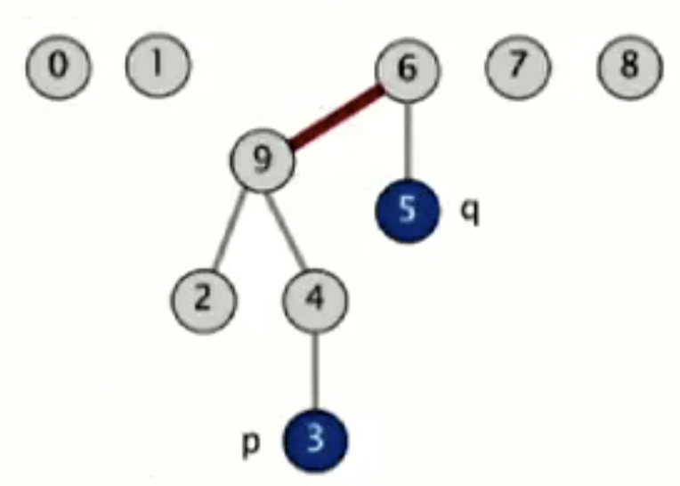

# Algorithms Part 1

[Link to the course](https://coursera.org/share/c54425f661da618dffedb7ba857a21c1)

**Algorithm:** method for solving a problem

**Data structure:** method to store information

## Week 1

Overview, dynamic connectivity problem, analysis of algorithms

## Dynamic connectivity

Problem: Maintain an undirected graph G so that edges may be inserted an deleted and connectivity queries may be answered efficiently.

Dynamic connectivity structure is a data structure that dynamically maintains information about the connected components of a graph.

Operations:
- ctor Initialize data structure
- void union (p, q) - add connection between p and q?
- bool connected(p, q) - are p and q connected?

### Solutions of the problem

#### Quick find

Data structure:
- integer array id[] of size N
- interpretation: p and q are connected iff (if and only if) they have the same id

Operations implementation:
- union - mark items of arrays with the same number O(N^2)
- find - check if items have the same number O(1)

N^2 algorithms are too slow, they don't scale. Newer computers are more powerful, and they have more memory, which consequently leads to the larger number of operations.

#### Quick union

Data structure:
- integer array id[] of size N
- interpretation: p and q are connected iff (if and only if) they have the same id

<b style="color: pink">Operations implementation:</b>
- union - to merge components containing p and q, set the id of p's root to the id of q's root
- find - check if p and q have the same root

