# Linux Academy Course

Notes for the [AWS Certified Solutions Architect – Associate Level](https://linuxacademy.com/course/aws-certified-solutions-architect-associate-level/)

**Security responsibilities**

Customer responsible for security **in** cloud. Amazon responsible for security **of** cloud.

**Service models:**

- IaaS - EC2. Responsibilities: Data, Applications, Runtime, OS (Updates)
- PaaS - Heroku. Responsibilities: Data, Applications.
- SaaS - gmail, netflix, outlook and etc. Responsibilities: Data.

**Highly Availability** is hardware, software, and configuration allowing a system **to recover quickly** in the event of failure. Example: get flat tier in a car. You change a wheel and continue driving. It's okay to stop and change the wheel.

**Fault Tolerant** is a system designed **to operate through a failure** with **no user impact**. More complex to achieve. Example: broken engine in a plane. A plane can't stop and fix the broken engine, that's why it usually has 2 engines.

**Disaster recovering:** RPO (Recovery Point Objective) and RTO (Recovery Time Objective).

RPO is how much business can tolerate to lose, expressed in time. The maximum time between a failure and the last successful backup.

RTO is the maximum amount of time a system can be down. How long a solution takes to recover.

**Types of encryption**

- Encryption at rest. When data is encrypted during storing (Encrypted hard drive)
- Encryption in transit. When data is encrypted during transition (HTTPS)

Some other terms:
- Application session state is data representing what customers do, what they have chosen, or what they have configured. If a server stores any data about user, it's a stateful server. For example, the server can store session.
- Undifferentiated heavy lifting: A part of an application, system or platform that's not specific your bushiness.

**Region** is a group of availability zones (AZ). An **AZ** is a data center. **Edge locations** are small pockets of AWS compute, storage, and networking close ot major populations and are generally used for edge computing and content delivery.

**CloudFormation** is an Infrastructure as Service tool you can create, manage and remove infrastructure using JSON or YAML. **Stack**(Docker image) is a mechanism containing logical resource based on Template (Docker file).

Stack creates\updates\deletes physical AWS resources based on its logical resources, which are based on the contents of a **template**.

CloudFormation notes:

- a template can create up to 200 resources;
- if a **stack** is **deleted**, then, by default, any **resources** it has created are also **deleted**;
- a stack can be **updated** by **uploading a new version** of template;
- **new logical resources** cause **new physical resources**;
- **removed** logical resources cause the stack to **delete** physical resources;
- **changed** logical resources **update** with **some disruption** or **replace** physical resources;

It's better not to specify the name of resources in a template because it can be reusable.

Ways of affecting resource in CloudFormation:
- updated without any disruption. Happens when changes minor configuration options;
- updated with some disruption. Example: changing ec2 instances size. In this case the instance must be reboot;
- replacement. Resources id deleted and created again

## Terms and abbreviation

**VPC** - virtual private cloud. It is a private subsection of AWS that you control, in which you can place AWS resources.

**CIDR** - Classless Inter-Domain Routing. It is an IP addressing scheme that improves the allocation of IP addresses. It replaces the old system based on classes A, B, and C. CIDR block size just defines how many IP addresses you need.

**IGW** - Internet Gateway. It's a service that provides access to internet.

**NAT** - Network address translation. It is a method of remapping source IPs or destination IPs packets. Static NAT: 1 private - 1 public. Dynamic NAT: M private - 1 public

**NAT gateway** - AWS service allocating a public IP for private instances. It needs a public subnet + elastic IP. NAT is not highly available.

**Security group** - a virtual firewall that can be attached to a particular instance. OSI L5. It can reference to the physical resources of AWS.

**NACL** - network access control list. It's an optional layer of security for your VPC that acts as a firewall for controlling traffic in and out of one or more subnets (OSI L4)

**Subnet** - isolated private network inside VPC. Each subnet belongs to AZ.

**DHCP** - Dynamic Host Configuration Protocol. A protocol that allows resources inside a network to auto configure IP addresses. It's a service that allows other services to obtain an IP address

**VPC Peering** - feature that allows contacting between several VPC

**VPC endpoints** - allow to connect to public AWS services like S3 without need to have IGW or NAT GW.

**Egress-Only Gateway** provides outgoing-only (and response) access for an IPv6-enabled VPC resource.

**FQDN** - full qualified domain name: www.linuxacademy.com

**Route53** is a DNS service in AWS

**CRR** cross region replication

**S3 object** - file storing in S3

**EFS** - elastic file system. It's AWS service like EBS but allows to be mounted to multiple instances

**OAI** origin access identity. Identity allowing to configure private distribution in CloudFront

**STS** security token service. Generates short live access tokens.

**ARN** (Amazon Resource Name) is unique identifier of any resource in any account, any region, anywhere inside Amazon.

## IAM (Identity and Access Management)

IAM controls access to AWS services via policies that can be attached to users, groups and roles. IAM denies any permissions unless explicitly granted.

### Terms

**Resources** - the user, group, role, policy, and identity provider objects that are stored in IAM.

**Identities** are the IAM resource objects that are used to identify and group. You can attach a policy to an IAM identity. These include users and roles.

**Principals** - a person or application that uses the AWS account root user, an IAM user, or an IAM role to sign in and make requests to AWS.

### IAM Policy

A policy is a JSON document containing AWS permissions that you assign to to a group, a role or a user.

A **managed policy** is a policy managed by AWS or customer.

An **inline policy** is a policy that's embedded in an IAM identity (a user, group, or role). That is, the policy is an inherent part of the identity. You can create a policy and embed it in a identity, either when you create the identity or later.

Policy is a set of "actions" that can be done on specific "resource". Resource is an AWS service like EC2.

Policy tips:
- if a request isn't implicitly allowed, it's implicitly (**default**) denied.
- if a request is explicitly denied, it **overrides everything else**.
- if a request is explicitly allowed, it's allowed unless denied by an explicit deny.
- Remember: DENY -> ALLOW -> DENY.
- Only attached policies you can any impact.
- When evaluating policies all policies are merged (all identity: user, group, role and any resource policy). 

### IAM User

IAM user is a type of IAM identity suitable for long-term access for known entity (human, service, application)

AWS allows to set boundaries for users. It means that if you allow a user to have access only to S3, a user won't be able to go beyond these permissions, even if you set other policies.

User tips:
- Hard limit of 5000 IAM users per account - this is important, as it can impact architecture
- 10 groups memberships per IAM user
- Default maximum of 10 managed policies per user
- No inline limit, but you cannot exceed 2048 characters for all inline policies on a IAM user
- 1 MFA user per user
- 2 access keys per user

Access Keys are not needed to be updated after assigning new permissions ot a user.

### IAM Groups

IAM group is a collection of IAM users. Group allow easier adminstration over steps of IAM users. Groups are not a true identity - they can't be the principal in a policy, so they can't be used in resource policies.

Groups notes:
- Groups are not **"true"** identities and they can't be referenced from the resource policies.
- Groups have **no** credentials.

ARN (Amazon Resource Name) is unique identifier of any resource in any account, any region, anywhere inside Amazon.

### IAM Roles

An IAM role is an IAM identity that you can create in your account that has specific permissions. Security Token Service (STS) generates a time-limited set of access keys (temporary credentials). These access keys have permissions defined in permission policy. IAM roles don't have long term credentials. However, instead of being uniquely associated with one person, a role is intended to be assumable by anyone who needs it.

It's not possible to log in via group. That's why it's not an identity.

A role has a **permission policy** and **trust policy**. Permission policy specifies what the role can do. Trust policy specifies who can assume the role. STS generates a temporary creds for the allowed identity that needs to assume the role.

Role can't be used when you need to log in into AWS console. Roles don't have user&passwords and any access keys.

Role can be used to provide extra access rights to an identity (a user for example) in case of emergency. 

You can create a generic role that can be assumed by another AWS account. If somebody will need to get access right of the role, he can assume the role and get access into your account. When role is assumed the STS generates a short living access token for the identity.

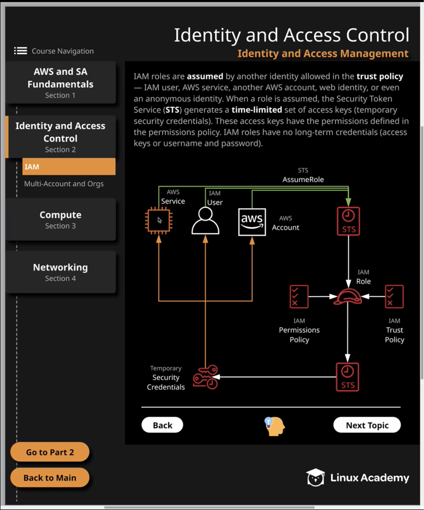

Roles notes:
- IAM roles have no long term credentials
- The role can be assumed by IAM users, AWS services, External accounts, Web Identities
- Temporary access token is generate by Security Token Service
- Trust policy controls who can assume the role
- Permissions policy defines the permissions provided
- Temporary credentials expire
- Example scenarios: company manager, aws service access, "Break-glass" style, cross account access, web identity federation

### AWS Organizations

It's a service for managing multiple accounts within a single business. Rather than managing many accounts with many isolated sets of logins and individual bills, organizations allows consolidation. 

All accounts with AWS organization can consolidate bills. Organization can share bulk discount.

Organization can have only 1 master account. A master account is created from a root user. Master account is responsible for billing.

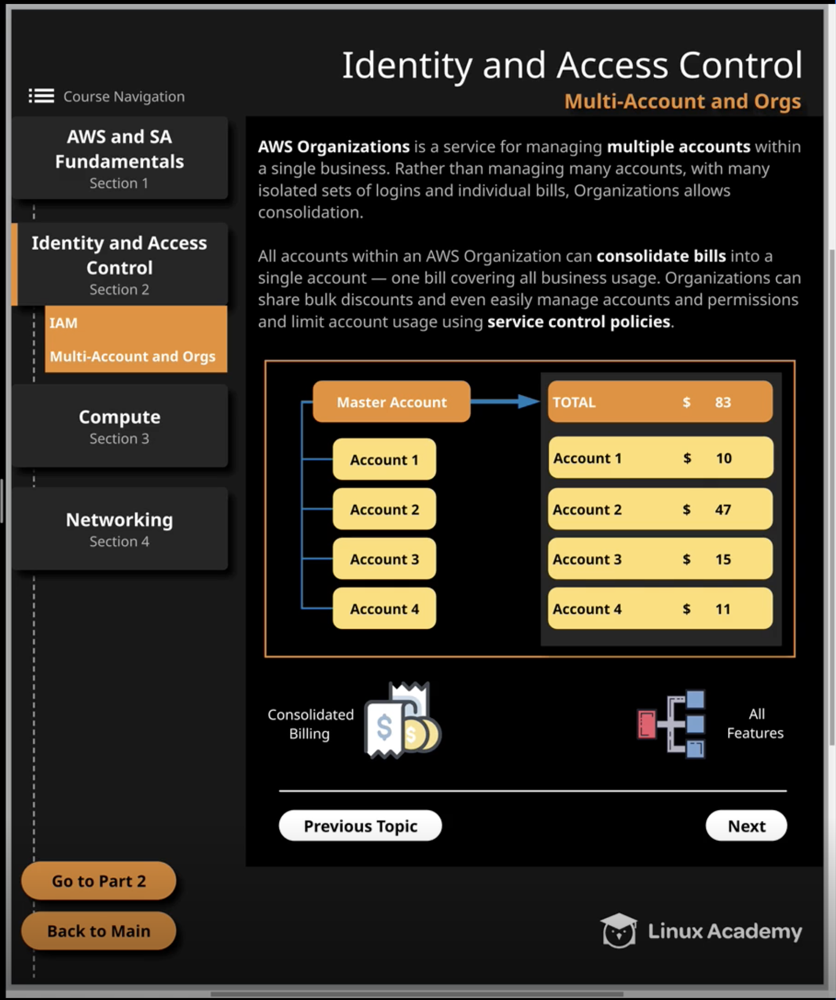

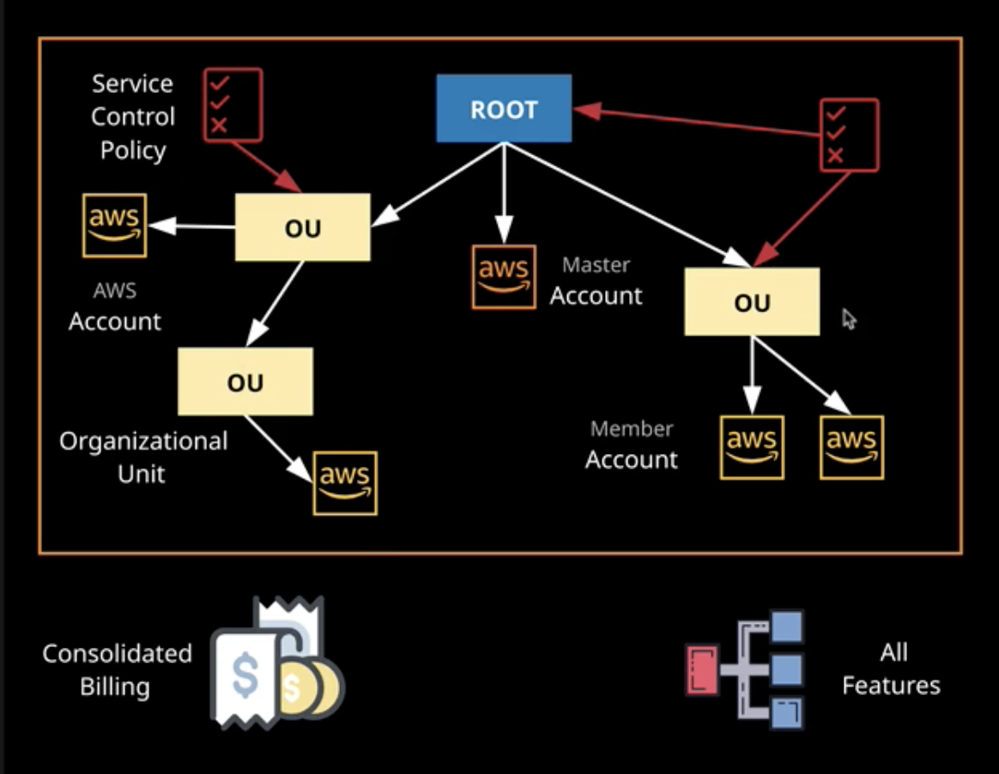

**Role switching** is a method of **accessing one account from another** using only one set of credentials. It's used both within AWS organization and between two unconnected accounts.

The only one way to restrict accounts under other organization units inside your organization is to enable Service control policies on root level. After it you can assign a policy to a sub organization.

## EC2

EC2 is a virtual machine shared between several customers on a host. Each AWS account create a default VPC. Each EC2 instance belongs to a single AZ.

Each EC2 is capable to use 2 types of storage:
- **Instance Store Volume** is a physical storage devices that are attached to EC2. If the instance fails, you'll all data on the storage. Usually used for temp high performance data that's can be lost.
- **Elastic Block Storage** is an attachable storage. You can attach it across different EC2 instances.

Security group is a firewall that specifies rules which allow or deny traffic to the instance.

CloudWatch monitors EC2 instances. It does health checks each 5 minutes. It's possible to reduce the interval with additional cost.
The status checks of EC2 instance checks the hardware and the instance state. 

EC2 instance states:
- Running
- Stopped
- Pending
- Stopping

When you stop instance you stop virtual hardware, when you stop a guest OS you actually shut it down. When EC2 instance is stopped or any other state except running you're not charged. You get charged each hour. EBS volumes incur charges. You need to terminate EC2 instance and delete EBS to 100% prevent charging. 

When you **start EC2** instance **again** you can be on **another host** with **other Instance Storage Volume**. Also you get new IP address.

When you **stop EC2** in VM you free resources on the host. It means that **EC2 get detached from the hardware**.

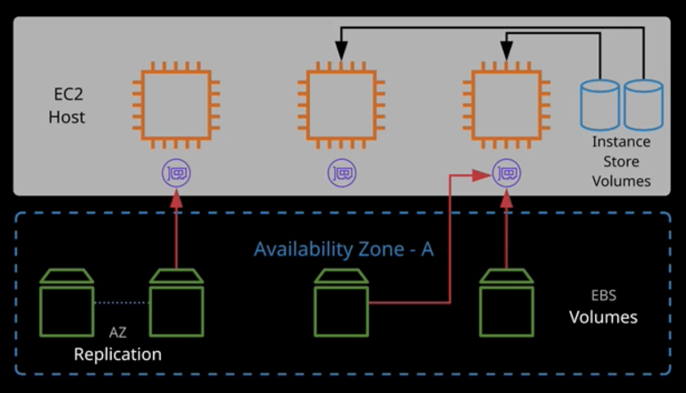

Stop "hibernate" - remembers the state of an instance and then run it in the same state.

When to use EC2:
- it need a traditional OS;
- something running and consuming CPU constantly;
- it's a monolithic app;
- app need a server to host;
- when something needs 

### Instance types and sizes

EC2 families (groups (Like a vehicle type: car, bus, motorcycle)): 
- general purpose - well balanced. Good CPU, good RAM, good storage. **Use case:** average microservices, backend, small and mid databases, dev. env., code repositories, virtual desktop. 
- computing optimized - best CPU available. **Use case:** high performance backend, microservices, MMO gaming, video encoding, high performance science and eng. apps, machine/deep learning *inference*.
- memory optimized - not bad or good CPU but really nice memory. **Use case:** high performance databases, distributed web scale in-memory caches, mid-size in-memory databases, real time big data analytics.
- storage optimized - provides super fast storage, (good for NO SQL DB). **Use case:** NoSQL databases (e.g. Cassandra, MongoDB, Redis), in-memory databases (e.g. SAP HANA, Aerospike), scale-out transactional databases, distributed file systems, data warehousing, Elasticsearch, analytics workloads.
- accelerated computing - very very specific hardware for specific task. **Use case:** machine learning,

Instance types:
- **T2** and **T3** - low-cost that provides burst capability;
- **M5** - for general workloads
- **C4** - more capable CPU
- **X1** and **R4** - optimize **large amount** of **fast memory**
- **I3** - fast **IO**
- **P2**, **P3**, **F1** - **GPU** and **FPGAs**

Instance sizes: nano, micro, small, medium, large, x.large, 2x.large, and larger

Special cases:
- "a": AMP CPU
- "A": ARM based
- "n": higher speed networking
- "d": NVMe storage

### Storage architecture

Elastic Block Storage (EBS) - a storage service that creates and manages volumes based on four underlying storage types. Volumes are **persistent**, can be **attached** and **removed** from EC2 instances and are **replicated** within a single AZ.

**EBS must be in the same AZ as EC2 instance.**

ENS

Volume types:
- sc1 (hdd, Cold HDD) - lowest cost, the slowest one, infrequent access, can't be a boot volume; (for archived data)
- st1 (hdd, Throughput optimized HDD) - low cost, throughput intensive, can't be a boot volume, good for log processing; big data; data warehouses; streaming workloads requiring consistent, fast throughput at a low price;
- gp2 (ssd, general purpose) - default, ballance of IOPS & MiB/s - burst pool IOPS per GB, recommended for most of workloads, virtual desktops, dev and test envs, low-latency interactive apps;
- io1 (ssd, Provisioned IOPS) - highest performance, can adjust size and IOPS separately, critical business application ;
- magnetic is deprecated

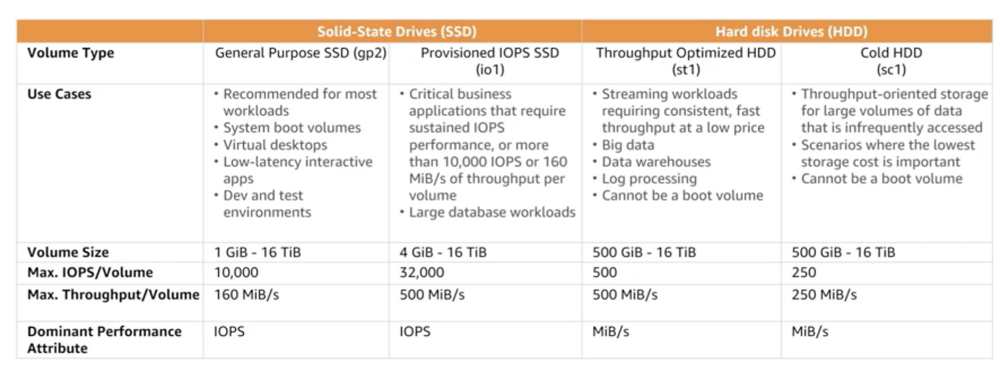

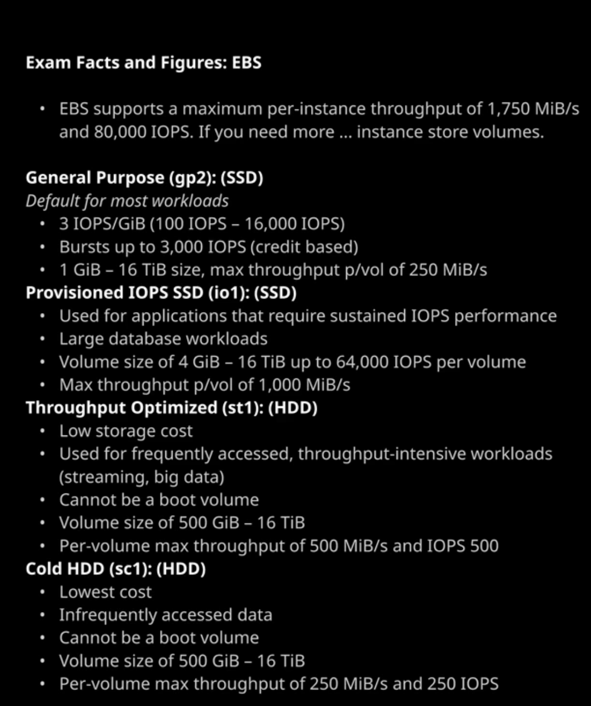

HDD can be a boot volume, but SSD can.

Main measurements of performance:

- **IOPS** - Input/Output Operations per Second. It measures amount of data that can be read or written per second; (SSD)
- **Throughput** - describes the amount of data that can be sent. (mb\s); (HDD)

Maximum available IOPS is 64000 IOPS (on the largest instance). 80000 IOPS for Instance Store Volume. 

To protect against AZ failure, EBS snapshots (to S3) can be used.
Data is replicated across AZs in the region and optionally internationally.

To move an EBS between AZs, you need to use snapshots

EBS snapshot works similarly to git commits. First snapshot copies all data, second snapshot copies only differences from previous state.

First, stop EC2 and only after this do snapshot. Otherwise other programs could update state or have something cached in memory. Data inside S3 snapshots are replicated across several AZ, so it won't be lost.

DLM (Data Lifecycle Manager) allows to automate the process of creating snapshots.

If you have 3 snapshots and you delete last snapshot, then the data from the delete snapshot goes to one of the other snapshots, so you never loose your data

Snapshots are replicated across several AZs so they are more resilient.

### Security group

Security group is a firewall. Each elastic network interface can **have maximum 5 security groups**. Each security group belongs to 1 VPC. 

Each security group has inbound and outbound rules. All security groups denies traffic by default.

Security groups don't allow to explicit deny, it's not possible to deny traffic for concrete IP address or an item. So you've to add only concrete allow rules.

Security groups can reference to any other security groups. 

### EC2 Metadata

http://169.254.169.254/latest/meta-data - the url returns metadata about the instance and can be accessed only within instance.

Examples:

- http://169.254.169.254/latest/meta-data/ami-id
- http://169.254.169.254/latest/meta-data/instance-id
- http://169.254.169.254/latest/meta-data/instance-type

### AMI

AMI is Amazon Machine Image. It's used to build instances. AMI is a snapshot of concrete EC2.

AMI include:
- Snapshots of EBS storage;
- permissions;
- a block device mapping (configures how the instance OS sees attached volumes);

AMI comes free, shared or paid. It can be copied to other regions.

Types of AMIs: that use EBS and ISV (used rarely).

AMI describes OS, Instance Type describes hardware.

**AMI is created from** the concrete **volumes**. It's like a snapshot for EBS, but for OS.

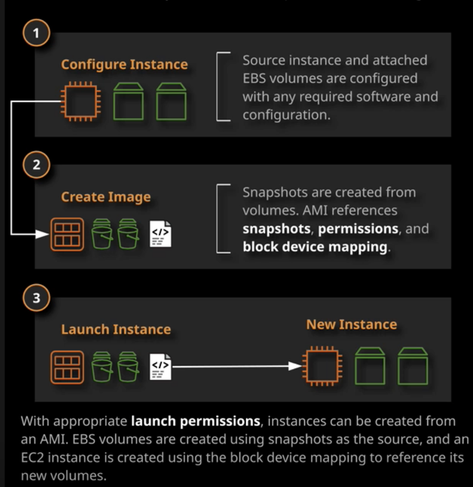

Use cases: 
- you developing a new version of app. You create EC2 instance, test and makes an AMI snapshot. After this you distribute the snapshot across whole EC2 instances.
- you have a complex app with complex configuration. If an instance gets broken you can easily launch a new one.

AMI limitation: no bootstrapping (a filed where you enter custom commands to run during initialization of an instance), it doesn't allow to customize an instance well.

When you set up permission for AMI you can:
- privately share with whitelisting;
- private sharable image;
- public sharable image;

### Bootstrapping

It's a process where instructions are executed on an instance during its launch process. Bootstrapping is used to configure the instance, perform software installation, and add application configuration.

In EC2, user data can be used to run shell scripts (Bash or PowerShell) or run cloud-init directives.

AMI are for your lengthy static configuration (faster). Bootstrapping is what you see for anything dynamic (longer). 

It's possible to combine both approaches. (Bootstrap are commands that you enter before running an instance).

When you create an instance you select an AMI.

If you prepared an instance and installed something very long, you can bake into an AMI. But you can't adjust baked software in the AMI. If you need configuring something you've to use bootstrapping, event if it's long.

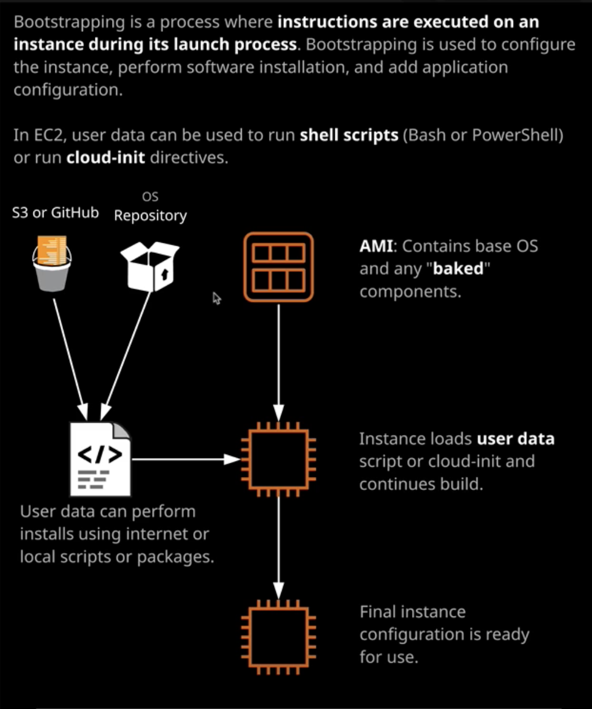

### Networking

ENI is an Elastic Network Interface. An IP address is assigned to an ENI. **Bigger instance more IPs it can have.**

- Public instance is an instance with public IP, that's available outside of your VPC.
- Private instance is an instance with private IP ONLY, that's available only INSIDE of your VPC. With private IP only the instance can't go to the Internet.

**Private IP** inside AWS is static, even if you stop your VM.

Private IP is allocated to internal `ip-X.X.X.X.ec2.internal` DNS. Private IP allocated when launching instance. Unchanged during stop/start.

Private IP is release only after terminating a VM.

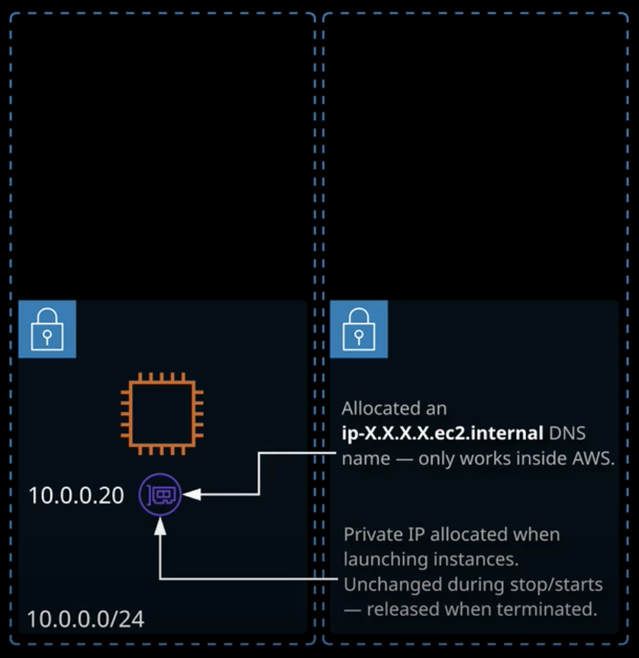

**Public instances** has the same private IP as private instance. 

`ifconfig` inside a public instance doesn't return a public IP address.

Public IP is changed after stop and start. Private IP is released after termination of an instance.

There's an Internet Gateway that sees traffic from private IP address to the Internet and swaps private IP with public IP. When response comes back it maps public IP to private IP. It means that it has key-value records of private and public IP. 

If you don't have an access to the Internet or from the Internet, you can't just apply a public IP to your instance. You need work with the Internet Gateway. 

IGW is a combination of hardware and software that provides your private network with a route to the Internet of the VPC. (Analogue is modem)

If you ping public DNS from AWS private network you'll get the  private IP. if you ping outside AWS, you'll get the public IP

If you reboot instance the public IP is NOT CHANGED. If you stop, the public IP is changed.

An **Elastic IP** address is a static IPv4 address associated with your AWS account in a specific Region

It is valid for whole region, not only for AI zone. When you assign an Elastic IP to the EC2, it won't be changed even if you restart the EC2.

Unlike the auto-assigned public IP address, an Elastic IP address is preserved after you stop and start your instance in a virtual private cloud.

When you assign an Elastic IP to a EC2 it replaces internal changeable public IP.

Elastic IP can be assigned to different EC2 instances.

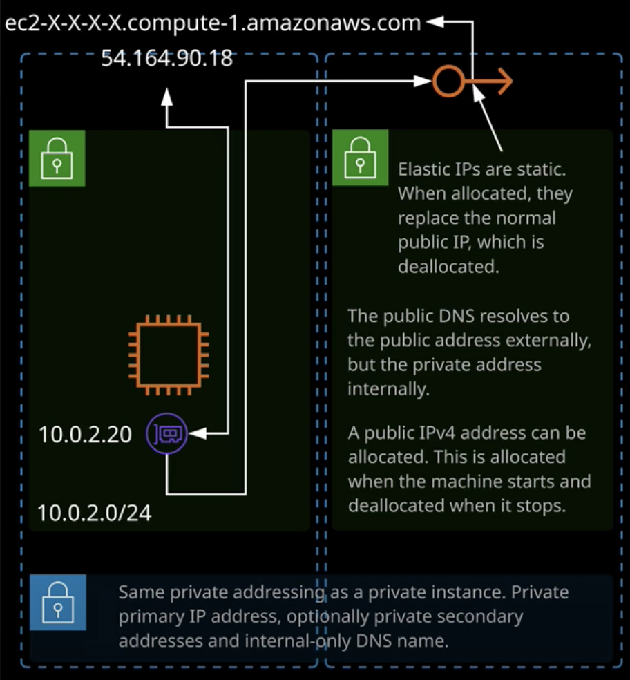

### Instance roles

EC2 instance roles are IAM roles that can be "assumed" by EC2 using an intermediate called an instance profile.

Instance roles allow to avoid using `aws configure` to get a token to get access to a service.

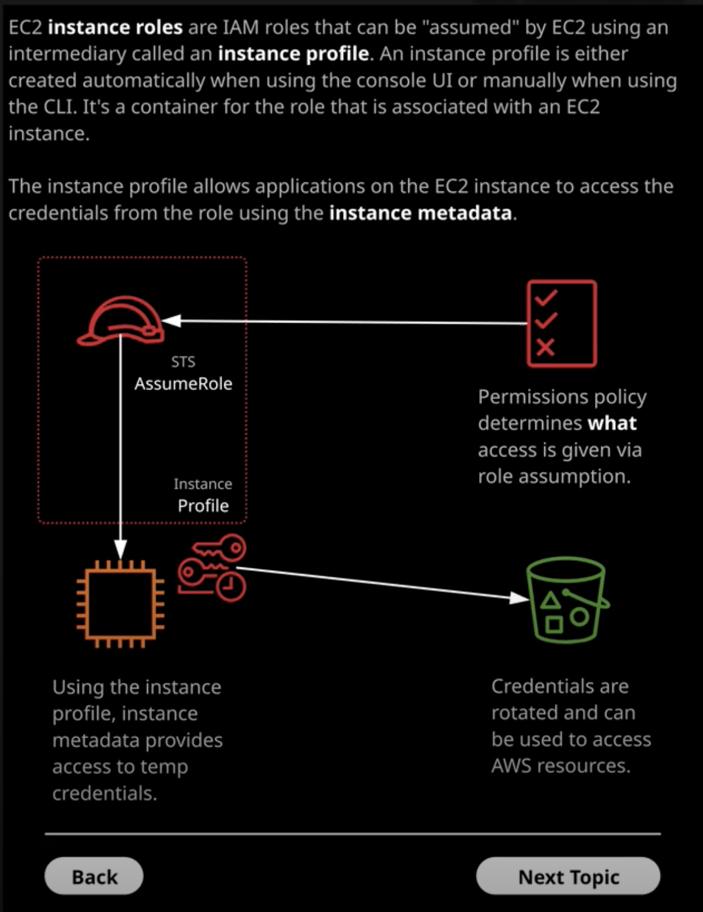

You assign a profile having the role to an instance. 

An **instance profile** is a container for an IAM role that you can use to pass role information to an EC2 instance when the instance starts.

The temp creds for EC2 comes via instance meta data. If you use assuming of roles you improve security of app. Because you get access via temp credentials that can be expired.

Roles won't work only when it's required to log into console.

An instance role sets permissions to an EC2 application or instance. An instance profile is a container for passing IAM roles information to EC2.

Access keys are long term credentials and shouldn't be used when bootstrapping.

**AWS creds options**

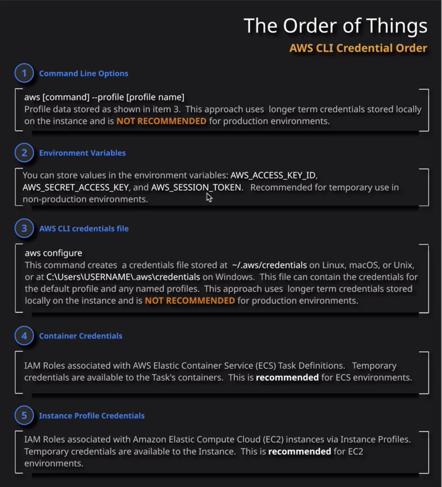

### EBS encryption

Volume encryption uses EC2 host hardware to encrypt data **at rest** and **in transit** between EBS and EC2 instances.

Encryption generates a data encryption key (**DEK**) from a customer master key (**CMK**) in each regin. A **unique** DEK encrypts each volume. Snapshots of that volume are encrypted with the **same DEK**, as are any volumes created from that snapshot. 

CMK is regional.If you moving the snapshot between AZs you don't need to get a new CMK. If you move the snapshot between Regions, you need a new CMK.

DEK has encrypted key and key in plain text. Plain text key is stored in memory of an instance. The encrypted key is stored in EBS. Next time when EC2 needs a plain key, it requests from KMS and KMS returns it to EC2. KMS creates a DEK from CMK.

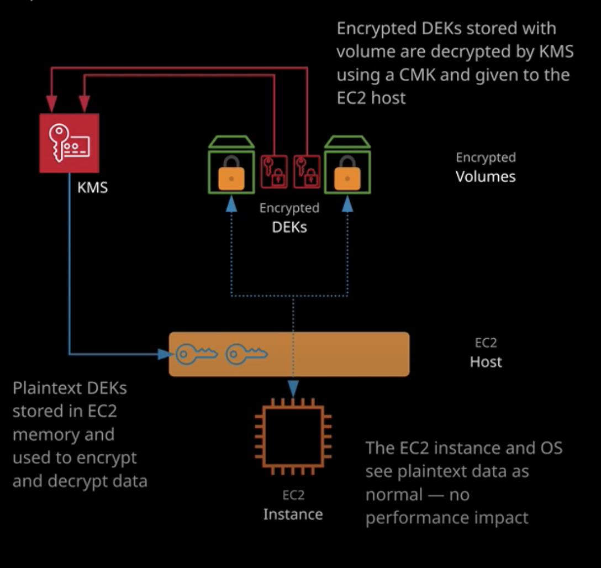

Key Management Service is a service providing cryptography keys for encrypting data.

- AWS managed keys - are keys managed by AWS
- Customer managed keys - are keys managed by a customer

It's not possible to create a **not** encrypted AMI from **encrypted** volume. Encryption doesn't have any impacts on performance for EC2. EC2 see the encrypted volume like not encrypted.

To encrypt data on the OS level, you need to use OS encryption.

### EC2 performance

**EBS path optimization**. EBS is accessed via a network wire. The wire can be used for both transferring network data and EBS data. The optimization is to use 2 wire for network and for EBS. (Not all instances has it.)

Benefits:
- Improved network data transfer rates. EBS-optimized instances do not share networking paths, they have improved network data transfer rates.
- Faster rate of storage performance. Since EBS-optimized instances do not share networking paths, they have faster rates of storage performance.
- A higher level of consistency. EBS-optimized instances are known for consistency in its storage and networking paths

Note: when you restore a EBS from snapshot, you won't have maximum performance of the EBS. It becomes available before all data is copied. If you access the data that wasn't restored then you've to wait unit it restored. 

**SR-IOV** - single root input output visualization. 1 host shares several VMs. The host has 1 network adapter, but VMs uses virtual network adapters that mapped to the real one. It means that 1 real adapter has many virtual. Recently the role of adapter was done by hypervisor, but now it's embedded into a real network adapter.

**Placement groups** has 3 types: cluster, spread, partition.

Cluster – packs instances close together inside an Availability Zone. Cluster placement groups are designed for performance. Every instance can tal to every other instance at the same time at full speed. Works with enhanced network for peak performance. **Optimization:** small latency. Maybe traffic even doesn't need to leave a host. For performance. Launch the same type of instance for Cluster group to make they are really close to each other.

**Partition** – spreads your instances across logical partitions such that groups of instances in one partition do not share the underlying hardware with groups of instances in different partitions. This strategy is typically used by large distributed and replicated workloads, such as Hadoop, Cassandra, and Kafka. Partition is isolated group AWS resources. Each partition has an isolated rack. Partition are useful for big infrastructure.

**Spread** – strictly places a small group of instances across distinct underlying hardware to reduce correlated failures. For highly availability

### Billing models

Key facts: 
- Instance size\type have an AZ spot price.
- Bid more, instance provision for spot price. Less = termination.
- Spot fleets are containers, allowing capacity to be managed
- Reservations are zonal (AZ) or regional
- One or 3 years, no upfront, partial upfront, all upfront.
- You pay regardless of EC2 instance using a reservation
- Regional is more flexible - but has no capacity reservation

Reservation types:
- **Regional:** When you purchase a Reserved Instance for a Region, it's referred to as a regional Reserved Instance. Benefits: can launch an instance in any zone, can launch an instance with different sizes. Reserve flexibility.
- **Zonal**: When you purchase a Reserved Instance for a specific Availability Zone, it's referred to as a zonal Reserved Instance. Benefit: reserve capacity. 

When AWS has problems with capacity in AZs it has priority:
1. VMs that was reserved (reserved capacity)
1. VMs on demand
1. VMs spot

**Spot**

Set max price that you can pay and if the instance price is below your spot, the instance works. Ridiculously inexpensive because there’s no commitment from the AWS side.

Use case:
- servers can tolerate failure and can be inactive for some time, state is not stored on the instance. Not use case: AD service, banking and etc.
Spot pricing was al about utilizing spare AWS capacity in order to get cheaper EC2 rates.
- cost-critical, which can cope with interruption
- burst-y workloads

On-Demand price: $1/hr
The market spot price: $0.2/hr
Your bid price: $0.5/hr
What you pay: $0.2/hr

**Reserved**

You reserve an instance and get a discount because helps AWS to predict load. You pay for instance even if it works. Full upfront: Don't need to worry about any hourly charges.

Use case:
- base\consistent load
- known and understood growth (you know how much capacity you need)
- critical system\components (higher priority for the reserved instances)

**On-demand**

There’s no commitment from you. You pay the most with this option.

Use case:
- Default or unknown demand
- anything in between reserved\spot
- short-term workloads that cannot tolerate interruption

**Dedicated host** is reservation of concrete server\pc, instead of part of it. You need to specify a concrete region for it.

Dedicated host supports on demand and reserved price. You don't pay for deployment instances on dedicated host.

## Serverless Compute (Lambda)

**Event driven architecture**

A system operates around "events" that represent an action or a change of state - e.g., a button being clicked, a file being uploaded, or a temperature dropping below a certain level. Events are efficient because events are generated and pushed, rather than things being polled. Polling requires always-on compute and doesn't scale well.

**Serverless architecture**

Serverless - you don't manage server

Two main principles of serverless architecture:
- BaaS (backend as a service) - using 3rd party services where possible rather than running your own. Example: Auth0, Cognito, Firebase, Google Analytics
- FaaS (function as a service) - products to provide application logic. There functions are only active when they are needed.

### Lambda

Lambda is FaaS. You charged only one when lambda works. A lambda can work only up to 15 minutes. It's invoked by events. The functions are stateless.

For EC2 you pay event if it's not used.

Events can come from other AWS services. For example: a file uploaded to S3 bucket.

Minimum billed duration is 100ms

Lambda reacts on events and performs actions. For example a file uploaded to S3 bucket, lambda is triggered and it create thumbnails of images that were uploaded.

### API Gateway

Allows to create API without code that can integrate with other AWS service or any other services.

It's a managed API endpoint service. It can be used to create, publish, monitor, and secure APIs "as a service". API Gateway can use other AWS service for compute (FaaS/IaaS) as well as to store and recall data.

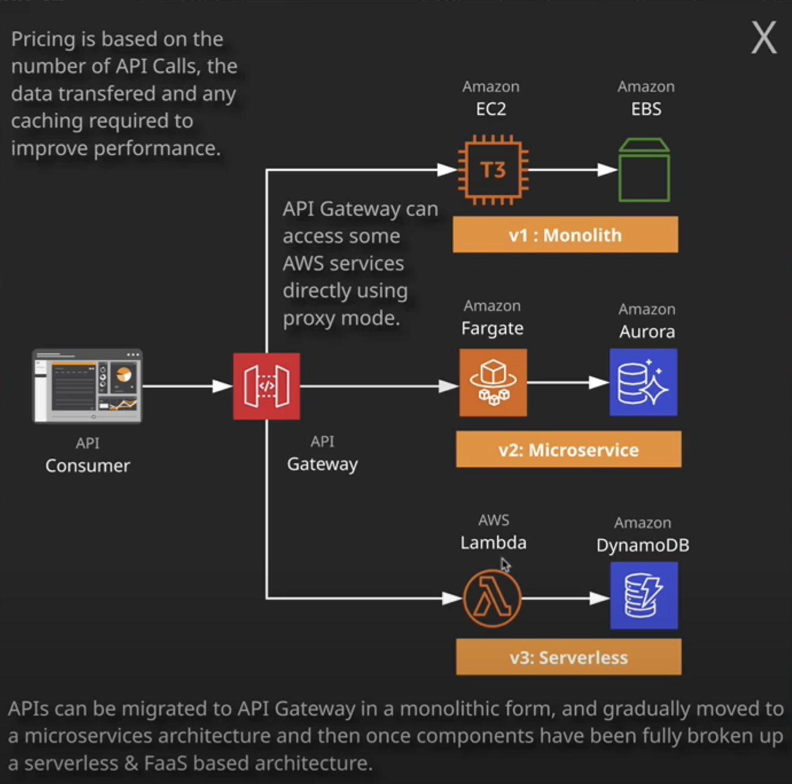

### Step function

**Step function** is a serverless visual workflow service that **provides state machine**. It can orchestrate other AWS service with simple logic, branching and parallel execution, it maintains a state. Workflow step is a state and it can perform work via task. Step functions allow for long-running serverless workflows. A state machine can be defined using Amazon States Language.

Step function is designed to overcome lambda limitations. Step function can be operated for up to 1 year.

Step functions can orchestrate lambda functions.

AWS Step Functions is a service that allows to keep state of lambda functions and aggregate them. It's a container for them.

Use case: you need serverless but with a state, merges, parallel execution, merges and etc.

Language to define state machine and steps is **Amazon State Language** (ASL)

Notes:
- API gateway supports serverless architecture
- to run a lambda you need: runtime, function name, code and permissions
- API gateway supports: serverless, microservices and monolithic app

## Container-Based Compute and Microservices

**VM vs Containers**

Containers work over OS. Each vm has own OS.

Containers are like apartments. VMs are like a house.

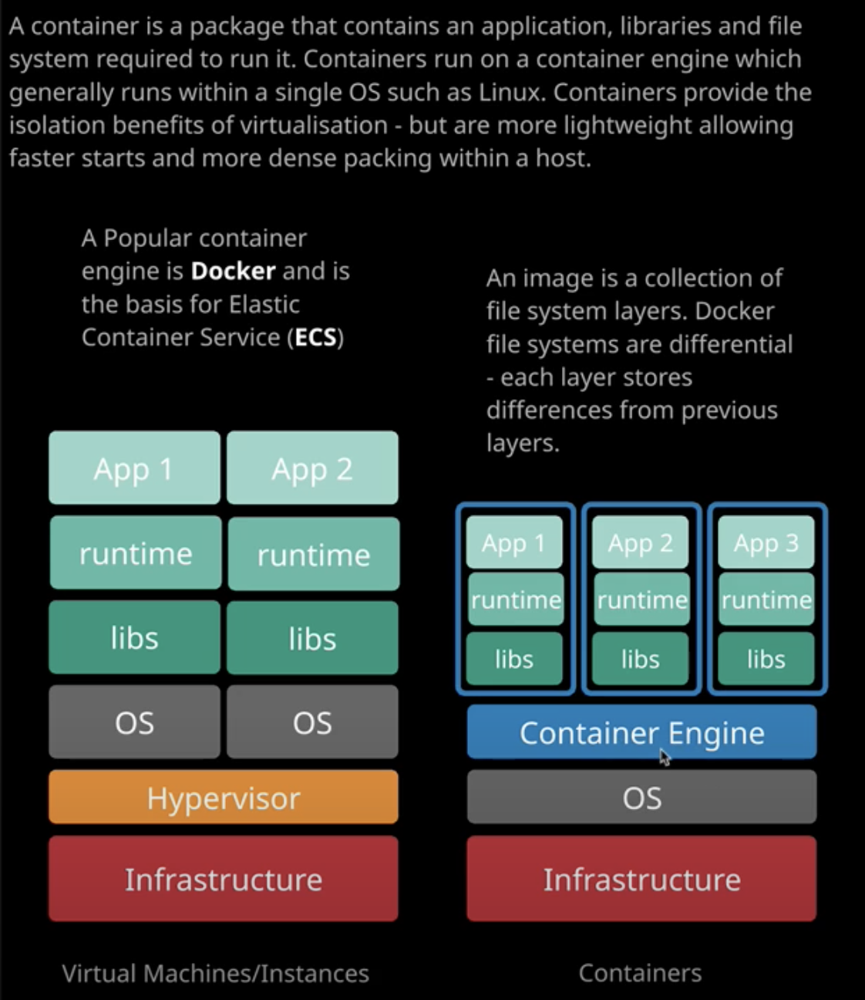

When you can't use docker:
- you need several OS
- your apps can't utilize same OS

### ECS

ECS is Elastic Container Service. It allows docker containers to be deployed and managed withing AWS environments. ECS can use infrastructure clusters based on EC2 or fargate where AWS manage the backing infrastructure.

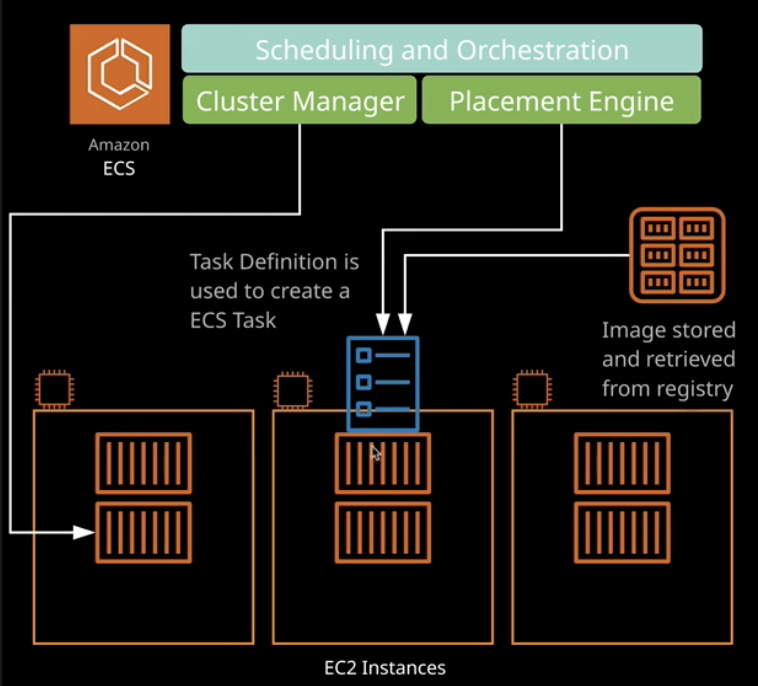

AWS fargate is a managed service tasks are auto placed.

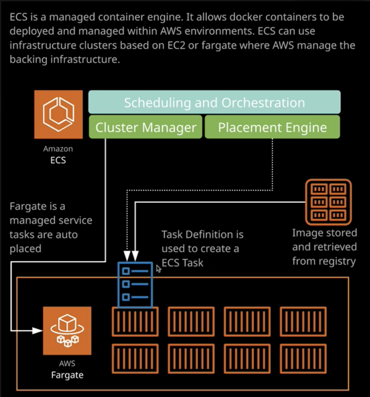

Terms for ECS:

**Cluster** is a logical collection of ECS resources - either ECS EC2 instances or a logical representation of managed Fargate infrastructure.

**Task Definition** defines your application. Similar to a Dockerfile but for running containers in ECS. Can contain multiple containers.

**Container Definition** inside a Task Definition defines the individual containers a Task uses. It controls the CPU and memory each container has, in addition to port mappings for the container.

**Task** is a single running copy of any containers defined by a task definition. One working copy of an application e.g. DB and Web containers.

**Service** allow task definition to be scaled by adding additional tasks. Defines Minimum and Maximum values.

**Registry** is a storage for container images.

ECS containers requires **Task role** permission to access other AWS services.

## Networking fundamentals

Layer 1 - physical. Voltage, zeros and ones.
Layer 2 - data link. Mac address
Layer 3 - network. IP
Layer 4 - TCP. Port, error checking.
Layer 5 - Session. Request and reply communication streams are viewed as a single 'session'
Layer 6 - presentation. Encryption, compression
Layer 7 - Application. HTTP, SSH, FTP.

### IP Addressing

IP address is a network address of a device. Subnet mask split an IP address into network and node part. Subnet mask allows to understand if nodes are in the same network or not.

Reserved\special IP addresses:
- 0.0.0.0 - represents all IP addresses
- 255.255.255.255 - IP address used to broadcast to all IP addresses everywhere
- 127.0.0.1 - localhost or loopback. This ip usually references itself.
- 169.254.0.1 to 169.254.255.254 a range of IP addresses which a device can auto configure with if its using DHCP and fails to automatically get an IP from a DHCP server.

## VPC

VPC is a private subsection of AWS that you control, in which you can place AWS resources (such as EC2 instances and databases). It's your private data center inside AWS platform. By default it prevent communication with outside world

IPv4 addresses are running out and Amazon allocates private IP addresses for VPC and sub networks. When requests leave VPC, they get public IP addresses via .

To enable setting DNS names, you need to enable it in VPC

VPC **Tenancy** allows to bind concrete VPC to concrete hardware.

VPC notes:
- can be configured to be public\private a mixture
- regional (can't span regions) highly available, and can be connected to your data center and corporate
- **isolated from other VPCs by default**. In case of hacker attack, the infected items will be isolated within the VPC
- VPC and subnet: max/16 (65 536) and minimum/28 (16 IPs)
- VPC subnets can't span AZs (1:1 mapping)
- certain IPs are reserved in subnets

Default VPC:
- required for some services, used as a default for most
- pre-configured with all required networking/security
- configured using a/16 CIDR block (172.131.0.0/16)
- A /20 public subnet in each AZ, allocating a public IP by default
- attached internet gateway with a "main" route table sending all IPv4 traffic to the internet gateway using 0.0.0.0/0 route
- SG: Default - all from itself, all outbound
- NACL: Default - allow all inbound and outbound

Custom VPC:
- can be designed and configured in any valid way
- you need to allocate IP ranges, create subnets and provision gateways and networking, as well as designed and implement security
- when you need multiple tiers or a more complex set of networking
- best practice is to not use default for production things

### Subnets

Subnet is a sub-section of a network. When you create a VPC, it spans all of the Availability Zones in the region. After creating a VPC, you can add one or more subnets in each Available Zone. Each subnet must reside entirely within one Availability Zone and cannot span zones.

- A subnet is located in one specific availability zone.
- Subnets must be associated with a route table.
- A private subnet doesn't have route to the Internet.
- A public subnet has a route to the Internet.
- It's possible to break a network by dividing on 2.
- It's not possible to overlap subnets within VPC

5 IP addresses inside each subnet are **reserved:**
- .0 - network address (10.0.0.**0**)
- .1 - router that routes traffic between subnets inside a VPC. If you configure other routes, it routes in\out of VPC.
- .2 - DNS - for dns of VPC
- .3 - future - for future uses
- .255 - broadacast address

Each subnet has 2^x - 5 ip addresses

DHCP is a service that allows other services to obtain an IP address. Each VPC can have only 1 DHCP service. It's not possible to change options of DHCP. It's possible to create a new one.

It's possible to share a subnet between AWS accounts inside 1 organization. Nobody can change the subnet, but people can deploy there something.

### Routing and internet gateway

Each VPC has a router. It's a highly available network device. Router routes traffic between subnets inside VPC. Routers are controlled via route tables.

VPC routing:
- every VPC has a VPC router
- router is scalable and controls data entering and leaving VPC and its subnets
- each VPC has a "main" route table, which is allocated to all subnets. A subnet must have only one route table.
- A route table controls what the VPC router does with traffic leaving a subnet

IGW is created and attached to a VPC (1:1). It can route traffic for public IPs to and from the internet

**Routes**

- An RT is a collection of routes that are used when traffic from a subnet arrives at the VPC router

A route table is a list of routes. Route tables see packets and checks if it can to pass the traffic from source to distention

A route table can have several routes to the same destination. Router picks the most specific

/32 - is a single IP. The higher mask, the higher priority of route item.

EC2 services don't have an IP address. There is a public address in VPC/router/igw that has key-value map for 

IGW handles communication between internet and VPC. It's can have 1 VPC and each VPC can have only 1 IGW.

When IGW receives any traffic from EC2 that has a public IP, it adjusts the packets. It replaces the private source IP address on the packet with the associated public IP address of that instance. It performs static network address translation. 

EC2 DON'T HAVE REAL PUBLIC IP. Public IP is replaced by IGW. IGW provides access to internet.

**To make a subnet public:**
1. resources should allocate public IP addresses (by default customer subnets don't allocate a public IP)
2. Allocate IGW
3. Add route tables that will target to IGW instance

BGP - Border Gateway Protocol

**Bastion Hosts**

Jump Box or Bastion Host is a physical or virtual machine that occupies a network publicly accessible and provides a locked-down entry point to a secure or fully private VPC. It's used for performing admin tasks.

- it's a host that sits at the perimeter of a VPC
- it functions as an entry point to the VPC for trusted admins
- allows for updates or configuration tweaks remote while allowing the VPC to stay private and protected
- generally connected to via SSH or RDP
- Bastion host must be kept updated and security hardened and audited regularly
- multi factor authentication, ID federation and\or IP blocks.

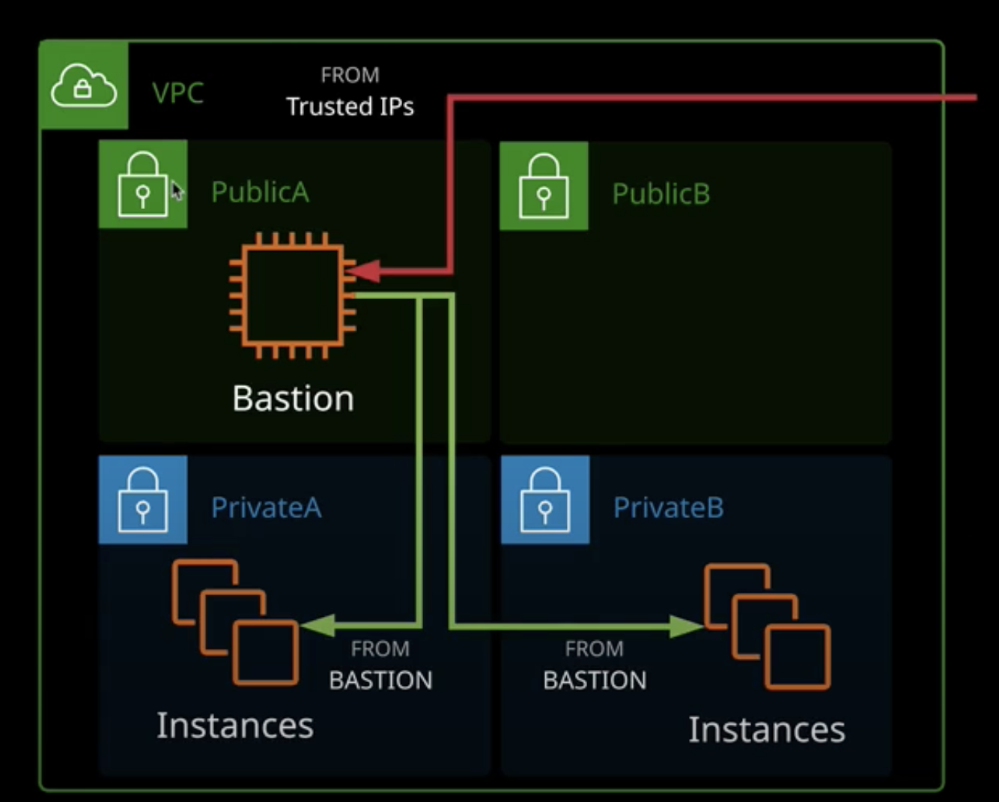

1. Bastion Host located inside public subnet
1. It has allocated elastic IP
1. Private EC2 from private subnet has a security group that allows the access from bastion host security group

### NAT 

Network address translation (NAT) is a method of remapping source IPs or destination IPs packets.

Static NAT: A private IP is mapped to a public (what IGWs do)

Dynamic NAT: A range of private addresses are mapped onto one or more public

NAT Gateway is a service that allocates a public IP for private instances. NAT gateway needs to be provisioned in a **public subnet** and it must have an **elastic IP**. NAT Gateway is NOT highly available.

Dynamic NAT can be done via: EC2 NAT or NAT Gateway.

### NACL

A NACL is an optional layer of security for your VPC that acts as a firewall for controlling traffic in and out of one or more subnets

NACL is associated with 1 or more subnet. NACL controls traffic that crosses subnet. Security Groups is more preferable then NACL. Security group is usually allow something. You can't explicitly deny something in Security group but you can do it with NACL. But NACL can deny something if it's necessary.

1. Rules are evaluated from lowest to highest based on "rule #"
1. The first rule fond that apples to the traffic type is immediately applied, regardless of any rules come after it
1. The "default" NACL allows all traffic to the default subnets
1. Any new NACLs you create DENY all traffic be default
1. A subnet can only be associated one NACL as a time.
1. An NACL allows or denies from entering a subnet. Once inside the subnet, other AWS resources (i.e. EC2 instances) may have an additional layer of security (security group)

By default all subnets automatically associated with default RT. If a subnet is associated with other RT, then it doesn't belong to a default RT. Each subnet belongs to only one RT.

- NACLs operate at layer 4 of the OSI model (TCP/UDP and below)
- A subnet has to be associated with a NACL - either the VPC default or a custom NACL.
- **NACLs only impact traffic crossing the boundary of a subnet**
- NACLs are collections of rules that can explicitly **allow** or **deny** traffic based on its protocol, prot range and source\destination
- Rules are processed in number, lowest first. When a match is found that actions is taken and processing stops.
- The "*" rule is processed last and is an implicit deny
- NACLs rules: **inbound** or **outbound**

Ephemeral ports:
- when a client initiates communications with a server, it's to a well-known port number (e.g., tcp/443) on that server
- the response is from that well-known port ot an 

NACL is more on the level 4. Security groups are more on the level 5.

NACL is usually used when you need to explicitly deny traffic. It's easier and better to use security groups

**How to design a network tips:**
1. Understand how many AZs you'll use. More AZs, more Resilient
1. Usually each region has 3 AZs and 3 AZs is a good starting point with an option to moving to 4th

### Test notes

**Default VPC has**
1. Security Group
1. DHCP
1. Public subnet
1. An attached internet gateway
1. NACL

**Default route table** covers all subnets inside VPC

**DHCP** is belongs to 1 VPC and 1 VPC can have 1 DHCP. DHCP enables any instance in a VPC to point to the specified domain and DNS servers to resolve their domain names.

**Bastion host** is an entry point for trusted admins

**NACL rules number priority** - lower numbers are the first to be processed. If something denied, it stops. 

**Dynamic NAT vs Static NAT gateway** SNAT gateways translates private to public IPs as at 1:1 ratio, while DNAT gateways translate a range of private IPs to public.

**IGW** Performs Static NAT and Handles the communication to and from the public internet. When the IGW receives a packet from a resource with a public IP, it will adjust the packets. It replaces the private IP with the associated public IP address. This process is known as SNAT.

### VPC Peering

Allows direct communication between several VPCs

Properties:

- Service can communicate via private IP addresses. That's why VPC peers can't overlap each other.
- VPC peers can span AWS accounts and even regions
- Data is encrypted and transits via AWS global backbone
- VPC peers are used to link VPCs at layer 3: company merges, shared services, company and vendor, auditing

Limitations:
- VPC CIDR block can't overlap
- VPC peers connect ONLY 2 VPCs - routing is not transitive
- routes are required at both sides (remote CIDR -> peer connection)
- Security regions can be referenced cross account, but not cross-region
- IPv6 support is not available across region
- DNS resolution to private IPs can be enabled, but it's setting needed at both sides

Process of creating VPC peer:
1. Create VPC peer
1. Add a route table that will route traffic to the target VPC, and another route table that will send traffic back from the target VPC
1. Make sure that NACL allows sending of traffic

Try to use completely different IP addresses for the all VPCs, so they don't overlap each other.

### VPC endpoints

VPC endpoints are GW objects created within a VPC. They can be used to connect to AWS public services without the need for the VPC to have attached IGW and be public because of security reasons.

VPC endpoints types:
- Gateway endpoints: can be used for DynamoDB and S3. They are inside region.
- Interface endpoints: can be used for everything else (e.g. SNS, SQS). Routing is not used. You create network routing objects that live in the specific subnet. Interface endpoints are inside concrete subnets (and AZs). Interface endpoint provides concrete endpoint for the specific resource. CLI interacts with public endpoints of the services.

VPC endpoints use route prefixes in route tables to add router VPC endpoint

Notes:
- Gateway endpoint are used via route table entries - they are gateway device. Prefix lists for a service are used in the destination field with the gateway as the target.
- Gateways endpoints can be restricted via policies
- Gateway endpoints are highly available across AZs in a region
- Interface endpoints are interfaces in a specific subnet. For HA, you need to add multiple interfaces - one per AZ.
- Interface endpoints are controlled via SGs on that interface. NACLs also impact traffic.
- Interface endpoints add or replace the DNS for the service - no route table updates are required.
- Code changes to use the endpoint DNS, or enable private DNS to override the default service DNS.

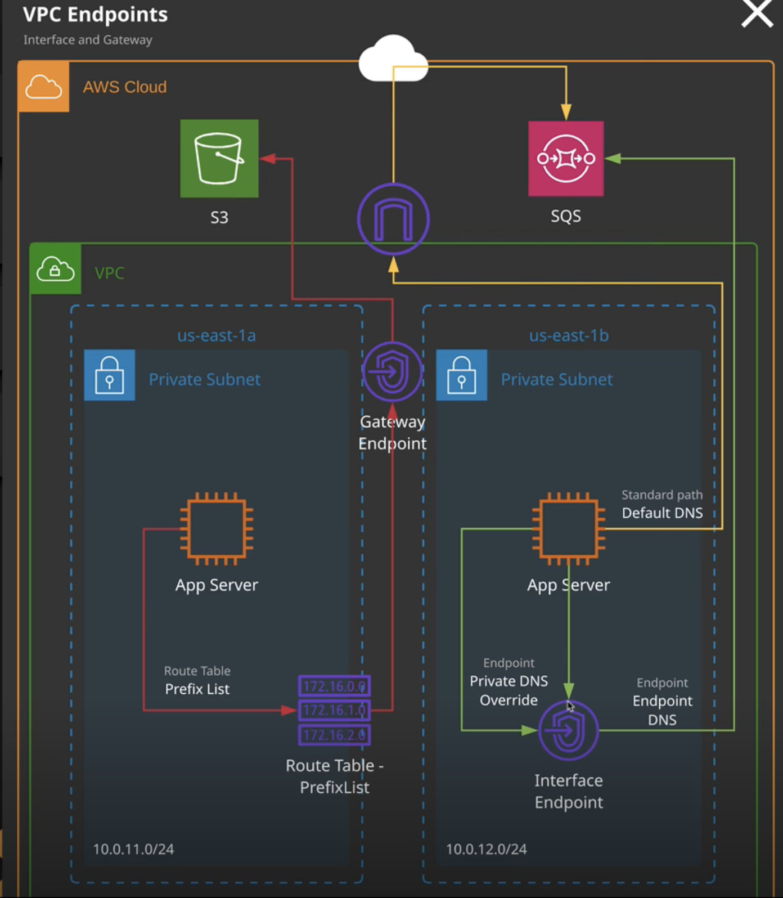

### IPv6

All IPv6 addresses are publicly routeable

- No DNS name for IPv6
- All IPv6 addresses are public
- DHCP6 configures public IPv6
- Elastic IPs are not relevant
- Not all services supports it

**Egress-Only Gateway** provides outgoing-only (and response) access for an IPv6-enabled VPC resource.

Notes:
- SG - can be shared between 2 VPCs in the same regions, multiple EC2s instance in a vpc, AWS accounts in the same region. **Security group can be shared between regions**
- NAT gateways are not supported for IPv6 traffic. Egress-only internet gateways should be used instead.
- Similarity of  gateway endpoints and interface endpoints: allow you to connect to a public AWS service without needing a public gateway or public IP, Both are VPC endpoints, Both can be used to achieve high availability.

## Global DNS (Route 53) Fundamentals

DNS - domain name system. DNS is a huge database that stores name and IP address of websites

.com - top level domain
google - is subdomain

There's a single root database of top level domains. This database delegates responsibility to keep data about subdomains -> hierarchy of domains.

FQDN - full qualified domain name: www.linuxacademy.com

**How to buy a domain**
1. Check if it's available
1. Purchase the domain via a registrar. Route53 takes money and contacts Verisign (.com operator), adds a record into the .com zone that represents your domain
1. Hosting the domain. 
1. Records in the zone file

**Zone** or hosted zone is **a container for DNS records** relating to a particular **domain** (e.g. linuxacademy.com)

Route53 supports public hosted zones, which influence the domain that's visible from the internet VPCs. 

Private hosted zones are similar but accessible only from the VPCs they are associated with.

Public zone:
- A public zone is created when you register a domain with Route53, when you transfer a domain into Route53 or if you create one manually.
- A hosted zone (has the same) has the same name as the domain. it relates to - e.g. linuxacademy.com will have a hosted zone called linuxacademy.com.
- A public zone is accessible from internet or from within any AWS VPCs.
- A hosted zone will have "name servers" - these are IP addresses you can give to a domain operator, so route 53 becomes "authoritative" for a domain

Private zone:
- Private zone are created manually and associated with one or more VPCs (and accessible only from them)
- Private zones need enabledDnsHostnames and enableDnsSupport enabled on a VPC.
- Not all Route 53 supported, limits on health checks
- Split-view DNS is supported, using the same zone name for public, and private zones. One DNS name can refer to different instances.

DNS records:
- A - IPv4 of an instance
- AAAA - IPv6 of an instance
- CNAME - Forwards one domain or subdomain to another domain, does NOT provide an IP address
- MX - mail server for given domain
- NS (Name Server) - used to set the authoritative servers for subdomain
- TXT - used for descriptive text in domain - often to verify domain ownership
- Alais Records - An extension of CNAME records. It allows to map AWS resources

### Routing Policy

**Simple** routing policy is a single record within a hosted zone that contains one or more values. Returns all values in a randomized order.

Pros: simple, the default spread of of requests
Cons: no performance control, no granular health check, for alias type - only a single AWS resource

It's possible to create alias but you'll point only to single AWS resource. It's not possible to create 2 records with the same for simple policy, but possible for failover and weighted.
You can specify several IP addresses. Simple policy returns a single answer with all IP addresses in random order. It's not possible to assign health check to 1 resource, only to the all resources that were returned.

**Failover** allows to you to create two records with the same name. 1 designed for primary web app, and another is additional in case of any problems with the primary.

1 primary route and 1 secondary

**Weighted** routing policy allows to control amount of traffic distributing across instances. It doesn't track highload of the instances, it just distributes traffic between of the instances. Useful when you need to test a new feature for, example. It's not used for load balancing.

**Latency** routing policy stores based on the lowest latency from the end-user to the resource. For every record that you created that uses latency-based routing, you specify the region.

**Geolocation** routing policy returns data only if you're in the same location as the Route53. If you're in Ukraine and try to get access to the server that's in USA, the ip address of the server won't be resolved. Default option returns data if nothing elses matches. Geolocation routing is used to present different content to users in different regions.

## S3

- nobody has permission except account created the bucket
- doesn't trust anybody and has no public access
- possible to assign identity policy only to identities under your account. No anonymous, no other accounts. You can't assign identity policy to account you don't control
- share access to a bucket: identity policy, resource policy, ACL (legacy)
- identity policy for identities, resource policy for resources. resource policy for s3 = bucket policy
- resource policy can allow access from other accounts or anonymous users
- bucket policies is applied inside the bucket itself
- rules priority: explicitly deny, explicit allow, implicit deny
- only ACL allows to manage access to concrete objects inside S3
- block public access rule overrides any allow rule
- upload file via single put. Up to 5GB. Single stream of upload.
- multipart upload: parallel uploading = faster. if individual part fails - you need to rewrite the individual part
- recommendation: more then 100 MB = multipart upload
- In an S3 multipart upload, an object can be broken up into 10,000 parts.
- s3 supports encryption at rest (on drive) and at transfer (ssl). at rest not encrypted by default
- client side encryption - you're responsible for encryption of data (do it manually)
- server side encryption with customer managed keys (**SSE-C**). S3 encrypt and decrypt data, but you're manage keys. You provide the key to s3, you tracks key rotation
- server side encryption with S3 managed keys (**SSE-S3**). S3 manages the keys, uses AES-256. KMS manages keys. 2 versions of the key: decrypted and encrypted. Decrypted is used for encryption object. Encrypted is stored with encrypted data. Admin role = encrypting data.
- AES 256 is the algorithm that used especially forSSE-S3
- sse with (**SSE-KMS**). Allows to distinguish users that get access to decrypted data. Possible to give access to s3, but restrict access to the key. with sse-s3 it's not possible
- encryption is per object, for not encrypted bucket. not specified encryption = no encrypting at all
- CORS allows to pull objects from different buckets
- it's possible to publish static website via s3
- versioning is turned off by default. without versioning: 1 object per name, deleted object is permanently deleted
- versioning is not possible to disable, only suspend
- you're billed per each version that you keep
- each version of an object is deletable
- MFA delete allows to delete data with MFA token
- presigned urls allows to embed access rights for private object inside url. You can share the link and anonymous user will be able to get it. Use case: possible to get access to the complete private bucket
- **s3 presigned url** is a temporary URL that allows users to see assigned S3 objects using the creator's credentials.
- presigned url is expirable. you use identity of the user who created the url. If you generate a presigned URL via a role, the URL may stop working faster then it will be expired
- presigned url allows to upload and download files
- you can't come back to standard storage class via automatic rules
- s3 encryption has no additional charge

**Tiers:**
- standard: default, when usage is unknown, replicated 3+ AZs, durability 99.99999999999%. Latency = ms
- standard IA: objects are available, but not frequent accessed. Additional charges 30: days ahead, minimum 128Kb. replicated 3+ AZs Latency = ms
- one-zone IA: reproducible objects, non critical. Additional charges 30: days ahead, minimum 128Kb. No use for important data. Use case: output of data processing. Latency = ms
- glacier: long-term storing, backups. Retrievals: 1-60 mins. Faster = more expensive. Replicated 3AZ
- glacier deep archive: for very long term backups. Replicated 3AZ
- intelligent: moves objects to IA if object was not used during 30 days and vice versa. Fee for monitoring and automation. Use case: access pattern is unknown. **No retrieval costs, but has fee for monitoring data**

- lifecycle rules allow automatically move objects between tiers
- lifecycle rules can be set up on prefix or bucket level
- lifecycle allows to expire objects
- S3 supports cross region replication (CRR)
- CRR requires both buckets to have versioning, replication rules, buckets must be in different regions
- CRR doesn't replicate existing files, doesn't apply lifecycle rules, SSE-C is not supported
- CRR can change file ownership and file's tier
- Objects after CRR keep their: object name (key), owner, storage class, object permissions
- data that was before turning on replication will not be replicated
- replication is 1 way only, from src to dst
- system events are not replicated: changing tier of an object
- SSE-S3 works by default during replicating, but SSE-KMS requires manually specifying key in the region. Because key is regional based
- SSE-KMS replication = encrypted -> copied -> decrypted
- SSE-KMS allows role separation
- replication use case: resilient or performance requirements, backups

## CloudFront

- CDN - product that takes product in center location and distributes them to edge location (closer to customers)
- CloudFront components: origin (s3, web server, e.g. source of files), distribution (configuration of CloudFront), edge location (infrastructure hosting caches), region edge caches (same as edge location but bigger, can host more, located in regions)
- content types of CloudFront: web = websites, css, images; RTMP = adobe flash media server
- getting data flow: user goes to edge location, edge location returns file or goes regional cache. Regional cache returns file or edge location goes to the origin and caches the file. Regional cache also caches the file
- list of trusted signer = private CloudFront. It makes whole CloudFront private
- it's possible  to grant access to s3 only via cloud front. Origin trusted identity (**OAI**) works only with S3
- OAI use case: access to S3 via CloudFront = better performance & better security. User won't go directly to S3
- reasons to restrict bucket access: user should have better performance and better user experience + security
- good performance: s3 + cdn
- Origin Access Identity can be applied on CloudFront distribution and Bucket policies. 
- Origin Access Identity is a virtual identity. It's special CloudFront user that can have policies
- it's possible to allies the domain name of CloudFront

##  EFS

- EFS is elastic file system that can be mounted to 100s of instances
- NFS (network file system) allows to deploy a file system into aws, which could be mounted on multiple linux instance at the same time
- EBS can be connected only to 1 instances in a time, while EFS can be connected to multiple instances
- To attach or detach EBS to another ec2, it must be in the same AZ
- EFS is for specific VPC
- "Mount target" is network interface that live in a particular subnet inside VPC. These targets that your EC2 instances will connect to using the NFS 4 or NFS 4.1 protocols.
- 1 mount target per AZ. more mount targets more resilient system.
- Throughput modes for mount target: **bursting** and **provisioned** (allows to extend bursting)
- bursting links size of EFS to its performance. Base: 100 MiB/s per 1TB
- EFS performance modes: **general purpose** and **max I\O** (for 100+ instances that needs access)
- EFS supports encryption at rest
- EFS accessible from local VPC, across VPC peering, across direct connection
- EFS designed for large and parallel access level, thousands of NFS clients mounting the same EFS and access data concurrently, can be used as a shared linux home directory
- EFS supports backups
- Service is region resilient so data is replicated across multiple AZs
- EFS is not object storage, it can't be accessible from CloudFront
- EFS supports 2 storage classes: standard and IA
- EFS has lifecycle management
- EFS security is controlled by security groups
- EFS is inside a subnet

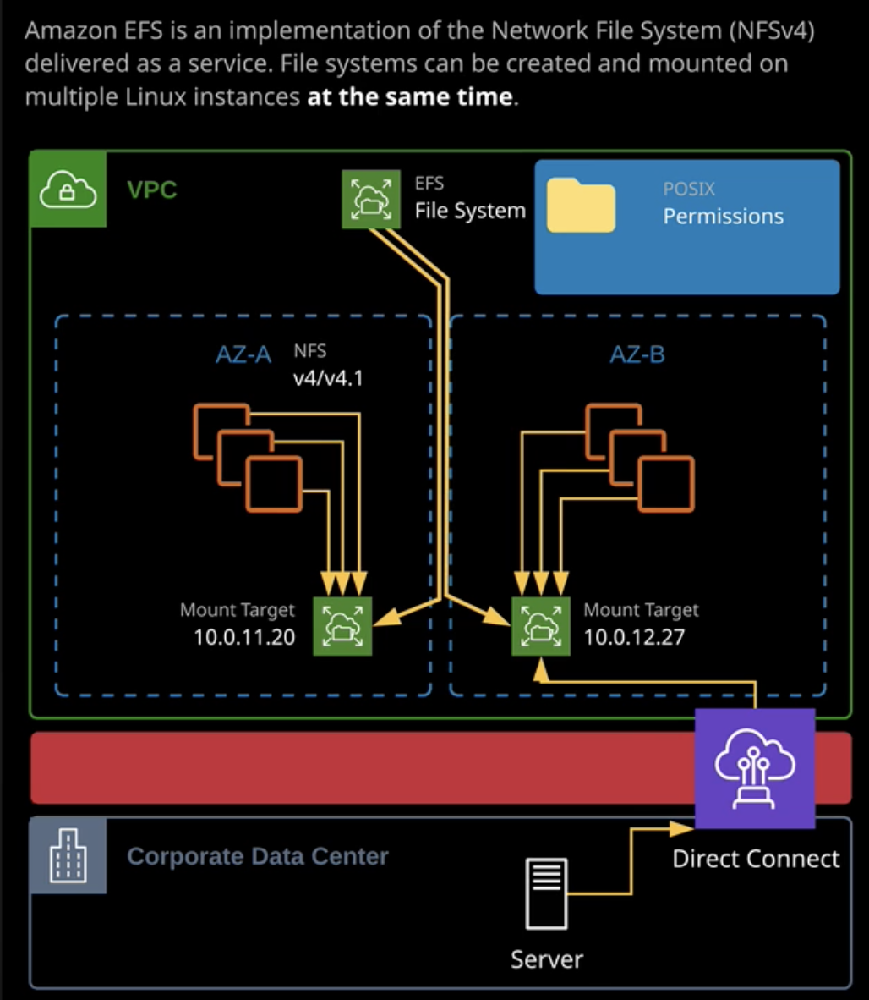

## DB fundamentals

- Normalization eliminates any redundant data and ensures any data stored together is dependented on each other
- NoSQL types: Key-Value, Document, Column, Graph
- NoSQL use case: user data, blog articles, medical records. Whatever that have 
- Key-Value + Document based: DynamoDB
- Document: Amazon DocumentDB
- Column: Amazon Redshift. Column based: on disk data stored in columns rather then rows. Good for analytics
- Graph: Neo4j. It stores relationships

## RDS

- RDS can be standard or HA
- RDS supports a number of different db engines: mysql, postgres, ms sql
- RDS can be deployed to a single AZ or multiple (support resilient)
- **RDS instance types.** General purpose (DB.M4 and DB.M5); Memory Optimized (DB.R4, DB.R5 & DB.X1e, DB.X1 for Oracle); Burstable (DB.T2, DB.T3)
- **Storage types.** General purposed SSD (gp2); Provisioned IOPS SSD (io1);
- RDS instances is **charged** for: instance size, provisioned storage (not used), IOPS if using io1, Data transfer out
- Snapshots\backups are free
- possible to purchase reserved DB instance
- most aws services have free in transferring
- RDS supports encryption. Can be configured during creation
- encryption can't be removed
- read replicas must be same encrypted\dencrypted as leader
- encrypted snapshots can be copied between regions
- rds snapshot allows manually to back up a database. manual snapshot has not automatic retention. the snapshot will exists after DB is deleted 
- automatic backups retention: 0-35 days. (0 is forever)
- backups are incremental and contains actual amount of data 
- automated backups are not designed to be long term
- restoring of db requires creating a new instance
- snapshots can be copied to other regions
- RDS resilience: read replicas or multi AZ mode
- **Multi AZ** mode creates a secondary stendby instance that's synced with the primary instance (**synchronous replication**)
- you can't use multi AZ replicated instance until the primary is failed. You pay money for the additional, but you can't use it.
- in case of maintenance the stand by instances is adjusted first, and after this the primary instance is updated too
- backups are taken from stand-by replica, so it doesn't hurt performance
- multi az is always inside 1 region, multiple AZs
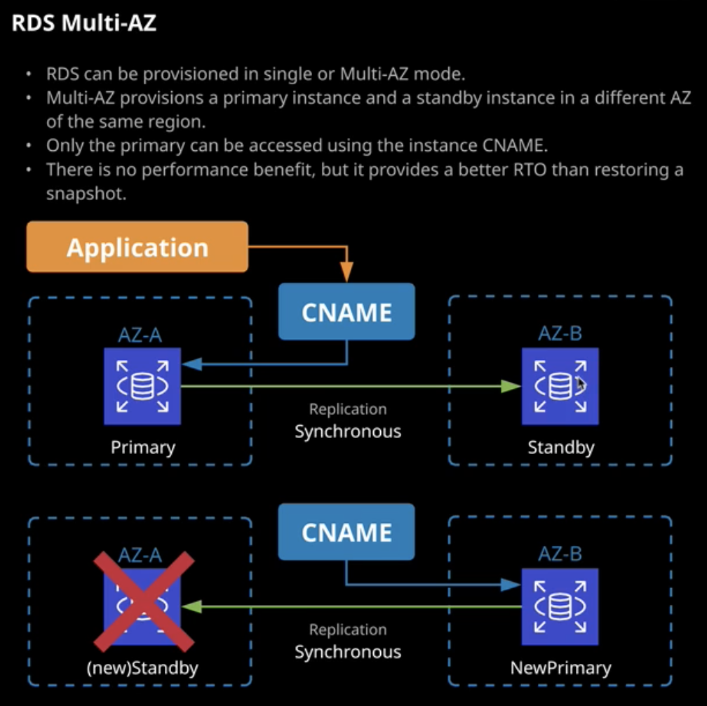
- multi az increases recover time objective, because it works faster
- read only replica can be created in other or same AZ, other regions and can be access directly
- it's possible to create multi az for read replica
- **read replica** is full feature DB that receives updates **asynchronously** from DB
- read replica required master instance to have enabled automatic backups
- reasons for read replica: faster to promote to master replica (comparing to restoring from snapshot) and independently accessible
- read replicas brings lags and eventual consistency
- read replica must be managed manually: updated and maintenance
- apps must be aware about read replicas and point them directly
- read replica must be manually promoted

## DynamoDB

- DynamoDB is somewhere between a key-value DB and document based db
- NoSQL, lightweight db product, not fixed schema
- Keys: sort(range) key, partition (hash) key. Sort + Partition = composition key
- Region based service
- Key-Value db. Value is 2 dimensional
- Table = collection, Item = Row
- Sort key for storing multiple entries of the same entity. WeatherInfo: WeatherStation + DateTime
- Max size of a row is 400KB (whole object, including keys)
- A table inside a region MUST HAVE a unique name
- it's private be default and resilient on regional basis. At least 3 replicas in AZs of partition (table)
- Automatically handles replications between AZs
- Partition is a 10GB storage unit. 1+ partitions per table.
- a hash function determines partition by partition key
- when you allocate RCU and WRU, you allocate them for partition
- each partition: 1 leader node (write\read), 2 non leader node (read)
- reading data: strongly consistent (read via leader) and eventual consistent
- all reads by default are eventual consistency (cheaper = consistent read / 2)
- Capacity mode: provisioned\on-demand (switching between modes = 24h delay)
- RCU read capacity unit, WRU write capacity unit
- 1 RCU for Strong Consistent = 4KB, 0.5 RCU for eventual consistent = 4KB (3KB to read = 1 RCU, 4.5KB to read = 2RCU)
- 1 WRU per 1KB
- When it's possible to large operations
- Read operations: **scan** and **query**
- Scan: takes whole table and whole capacity and then removes not matched data. More flexible. Can be used without partition key
- Query: goes through table without reading every item (when you used partition or sort key). Consume capacity corresponding to returned value. Limitation: can't query without partition key, can query only by 1 key. If you need query by sort key - go scan. Query more preferred = more efficient
- Backups = Point in time recovery mechanism (stores up to 35 days). Possible to backup manually
- all data is encrypted by default in DynamoDB
- global tables is multi region, master-master replication. Written last wins the conflict. So the latest data is overwrite previous
- global tables require enabled streams and a region
- stream - a rolling 24 hours window of changes. stream per table
- items that come to stream (stream views): key only, new state, previous state, previous + new
- dynamo db streams are highly available
- indexes: LSI (local secondary indexes), GSI (global secondary indexes)
- LSI is created during creating of a table. Works with composition keys only. LSI allows using an alternative sort key to allow **querying** on other attribute instead.
- LSI is a part of main table and share RCU and WRU. MAX 5 LSI per table
- LSI is the same data, just ordered in another way -> same rcu, wru
- GSI = new partition + sort key. max 20 per table. possible to create on existing table. Also allows querying on new keys. Possible to have more then 20 via support
- GSI has new keys = a different set of data = extra cost over your base tables
- projected attributes - allows changes size of information containing in index. need not projected attrs -> go to main table = performance penalty
