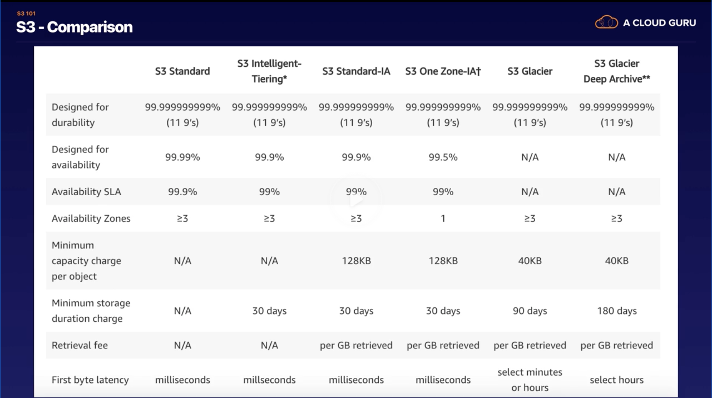

# AWS certified solutions architect associate

Notes for [AWS certified solutions architect associate](https://acloud.guru/learn/aws-certified-solutions-architect-associate) course.

Exam:

- 130 Minutes in length;
- 65 Questions
- Multiple Choice
- Results are between 100 - 1000 with a passing score of 720
- Aim for 70%

**Availability Zone** is one or many data centers. Each region consists of many AZs.

**Edge location** are endpoints for AWS which are used for caching content. Typically this consists of CloudFront, Amazon's Content, Delivery Network (CDN). There are many edge locations, more than Regions. Over 150 edge locations.

## Compute

## S3 Storage

S3 (Simple Service Storage) - secure, durable, highly-scalable object storage. Amazon S3 is easy to use, with simple web service interface to store and retrieve any amount of data from anywhere on the web.

### Storage classes of objects

### S3 price tiers

Charges:

- Storage - more store more pay
- Requests - more requests more pay
- Storage Management Pricing
- Data Transfer Pricing
- Transfer Acceleration
- Cross Regin Replication (replication of buckets from one region to another)

**Tiers:**

- S3 Standard (general purpose storage for any type of data, typically used for frequently accessed data)
    - First 50 GB / Month = $0.023 per GB
    - Next 450 GB / Month = $0.022 per GB
    - Next 500 GB / Month = $0.021 per GB
- S3 - IA (for long lived but infrequently accessed data that needs milliseconds access)
    - All storage / Month = $0.0125 per GB
- S3 - Intelligent Tiering (automatic cost savings for data with unknown or changing access patterns)
    - First 50 GB / Month = $0.023 per GB
    - Next 450 GB / Month = $0.022 per GB
    - Next 500 GB / Month = $0.021 per GB
    - Infrequent Access Tier, All Storage / Month = $0.0125 per GB
    - Monitoring and Automation, All storage / Month =  $0.0025 per 1K object
- S3 - One Zone - IA (for re-creatable infrequently accessed data that need milliseconds access)
    - All storage / Month = $0.01 per GB
- S3 - Glacier (for long-terms backups and archives with retrieval option from 1 minute to 12 hours)
    - All storage / Month = $0.004 per GB
- S3 - Glacier Deep Archive (for long-terms data archiving that's accessed once or twice in a year and can be restored within 12 hours)
    - All storage / Month = $0.00099 per GB

There's no more reduced redundancy. Might be cause sometimes files were lost.

### S3 Security

By default all created buckets are private

Types of policies:
- bucket policies (on the bucket level)
- Access Control List (on the object\folder level)

It's possible to set up log of all requests made to the S3 bucket

Idea of security is if somebody break into the data center and steal the hard drive with your data, the theft won't be able to access the data

**Encryption**

Encryption in transit is achieved by SSL/TLS (HTTPS)

Encryption At Rest (Server Side) is achieved by:
- S3 Managed Keys - SSE-S3 (AWS managed encryption keys)
- AWS Key Management Service, Managed Keys - SSE-KMS (Managing the keys with AWS Key Management service)
- Customer Provided Keys (Customer specifies keys)

Client Side encryption (when a customer uploads encrypted data)

### Other

**Versioning**

- Versioning allows to store all versions of object (including all writes even if you delete an object)
- It's a great backup tool
- Once enabled, versioning can't be disabled. Only until you delete entire bucket and create it again
- Stores all versions of object an object (including all writes and even if you delete an object)

**Lifecycle rules**

Lifecycle allows to automate transitioning of files. It's possible to set up moving files between storage classes, deletion of expired files and etc

**S3 object lock** is a feature that allows to prevent modifying or deleting of documents for some period amount of time or indefinitely. It's WORM model (Write once, read many).

S3 object lock modes:
- government mode. Users can't update or delete an object version or alter its lock settings unless they have special permissions. You can grant permissions to update them;
- compliance mode. Nobody can update or delete including the root user;

Retention period specifies how long an object can't be modified

Legal hold is the same as object lock but for the versions

**Glacier Vault Lock**

A Vault is a container for glacier

S3 glacier vault lock is the same as object lock but for vaults

**S3 Performance**

S3 provides a low latency. 100-300 milliseconds to get data
More prefixes, more requests.

### Summary

- it's possible to upload a file from 0 bytes to 5 TB;
- there's unlimited storage;
- files are store in the buckets (bucket is a root folder);
- S3 is a universal namespace. That's, names must be unique globally;
- Not suitable to install OS;
- You can turn off MFA Delete;
- Successful uploads returns 200;
- Read after Write consistency for PUTS of new objects. Eventual Consistency for overwrite PUTS and DELETE (can take some time to propagate)

## Databases

## Network & Content Delivery

## Security, Identity & Compliance

IAM (Identity Access Management) allows to manage users and their level of access to the AWS Console.

Key Terminology for IAM:

- users;
- groups are set of users;
- roles are policies for AWS resources;
- policies are set of rules. Usually formatted in JSON format.
