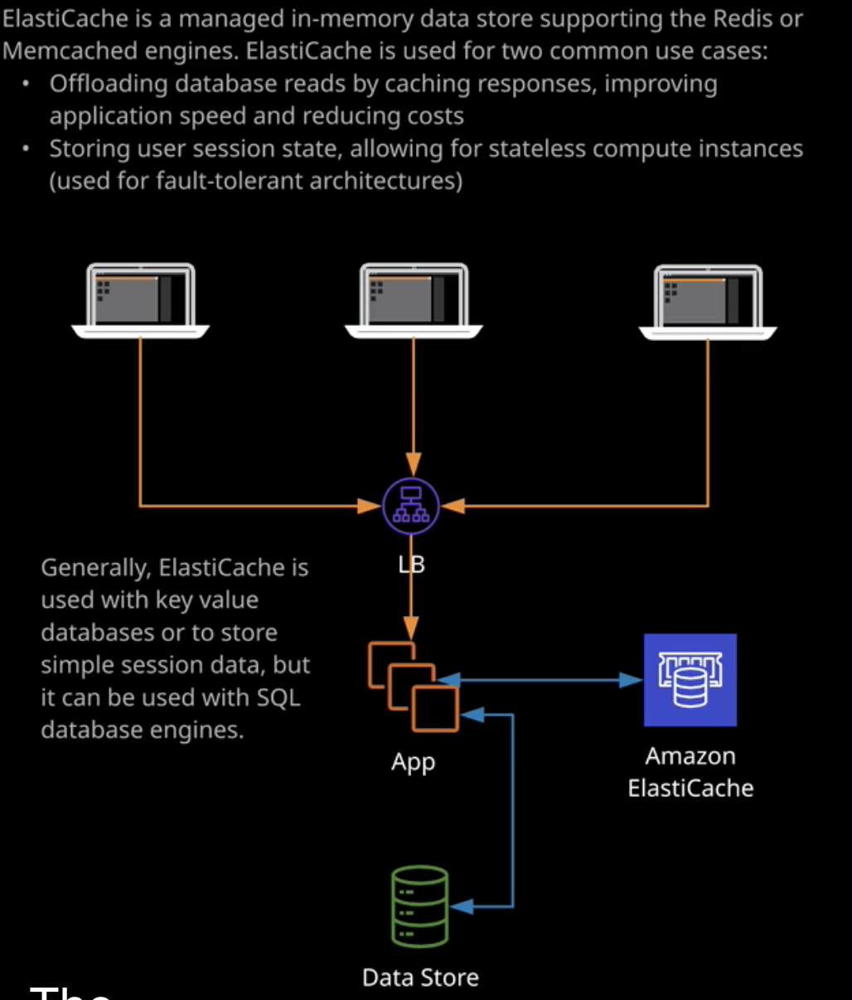

# DAX (DynamoDB accelerator)

It's a memory cache designed for dynamo DB providing data in microseconds

- DAX works inside VPC, use cluster architecture
- designed for high level read workload
- cache TTL = 5 mins
- stores data for **query** and **scan** operations

Use case:
- the fastest reading response within milliseconds
- the app does a lot of reads

Not use case:
- need strong consistence read. DAX provides eventual consistency. 
- the app does a lot of writes

## ElastiCache

Managed in-memory data store supporting the **Redis** or **Memcached** engines

Use cases:
- offloading db reads by caching responses, improving app speed, reducing costs;
- storing user session state, allowing for stateless compute instances; 

