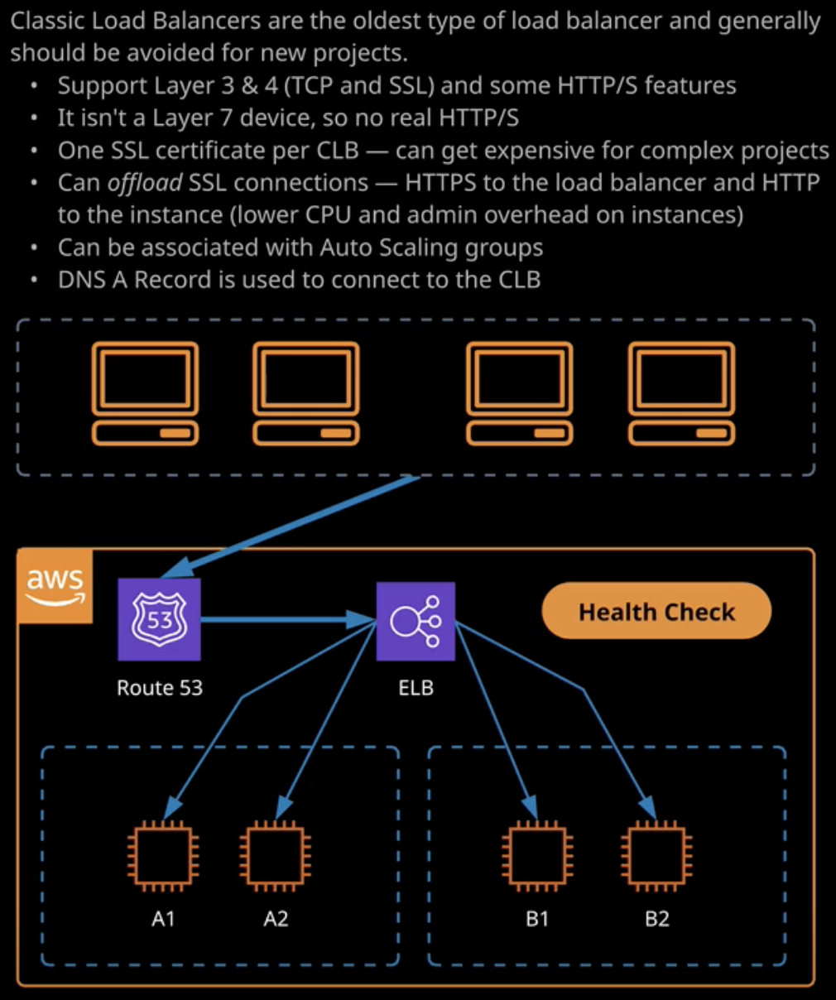
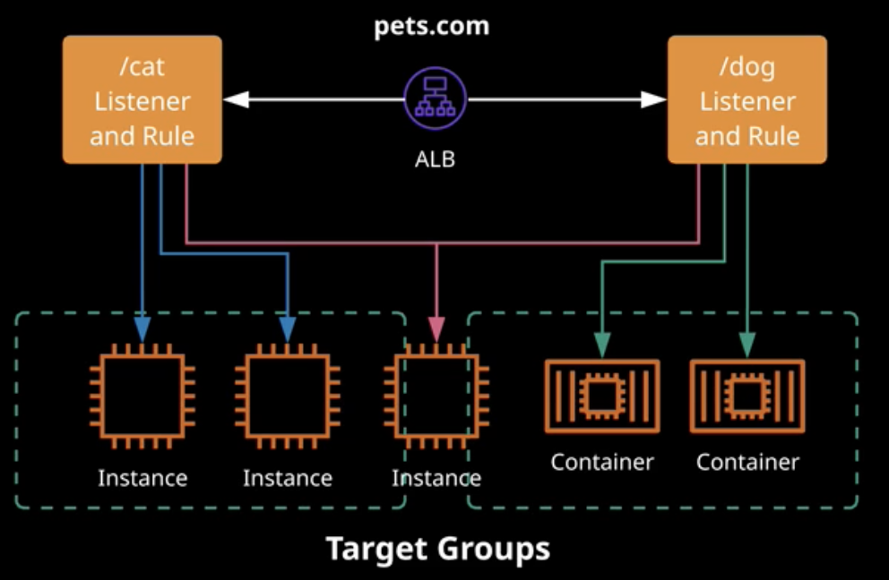

# Load Balancing

Load balancing distributes incoming traffic for across a groups of servers or services.

- ELB (elastic load balancer) is AWS service providing load balancer. Types of load balancing: classic (CLB), application (ALB), network (NLB).
- Load balancer lives inside an AZ. It can distribute traffic only inside 1 AZ by default. **Cross-zone** load balancing allows to distribute traffic across several AZs
- ELB can paired with Auto Scaling group
- DNS name -> Load balancer -> concrete service
- load balancer is component of EC2
- LB exists inside VPC
- types of LB: internet facing LB and internal LB
- internal works with private ip only and used when you need distributes traffic between app tiers
- ssl offloading = traffic goes to LB encrypted, LB sends traffic to the instances being not encrypted
- security groups restricts traffic + can restrict access to ec2 only from LB
- best practice: prevent direct access to instances. Only via load balancer

## Classic Load Balancer

- the oldest load balancer and should be avoided for most of projects
- not recommended because support mostly layer 3&4 (tcp and ssl). It allows to make decisions based on only these layers
- supports some HTTP/S features. it's not a layer 7 device, so no real http/s. For example, for health check it can only make sure that response is 200
- 1 ssl per CLB -> can get expensive for complex projects
- 10 apps -> 10 ssl -> 10 CLB

## Application Load Balancer

- Designed to replace classic CLB
- Content rules can direct certain traffic to specific targets groups: Host based and Path based
- ALB supports: EC2, ECS, EKS, Lambda, HTTP, HTTP/2 + web sockets. Also can be integrated with Web App Firewall (WAF)
- Targets -> Target Groups -> Content rules
- An ALB can host multiple SSL certificates using SNI
- **Content rules** allow to specify where and how navigate traffic
- **Target group** is a group of EC2 instances. Benefit: health check of a target group -> check each service -> no need to point LB to each service
- Allows to host several DNS -> no need to create LB per DNS -> no need to create a ssl per dns
- supports layer 7 in OSI -> can redirect traffic based on host name, uri, headers and etc.

## Network Load Balancer

- **Less latency** then ALB because doesn't care about layer above (scale up to millions requests)
- IP addressable - static address
- best load balancing performance within AWS
- source IP address preservation - packets unchanged
- targets can be addressed via IP addresses

## Launch templates and configurations

- **auto scaling groups** allows to implement highly available products
- **launch configuration** is older then **launch templates**. Use launch templates
- the templates specifies what you want to launch
- **launch config** and **launch template** are immutable, it's not possible to change it after creation
- launch config uses the same wizard for creating instances
- **launch templates** allow to **inherit** existing templates
- Launch template provides: versioning and inheritance, tagging, elastic graphs, T2\T3 unlimited settings, placement groups, capacity reservation, tenancy option
- autoscaling groups work based on launch templates and launch configuration
- autoscaling groups allow to specify scaling policies
- autoscaling group can't go the min
- unhealthy instances will be terminated by autoscaling groups
