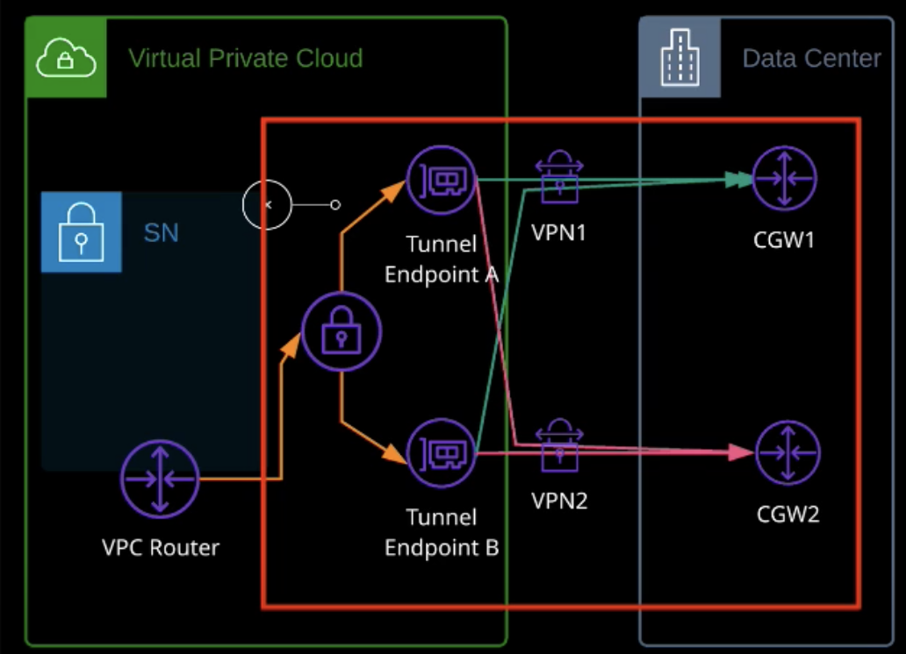

# VPC VPN

- VPN operates over IPv4

VPC VPN components:
- a virtual private cloud (VPC)
- virtual private gateway (VGW) attached to a VPC. ONLY 1 per VPC
- a customer gateway (CGW) - configuration for on-premises router (router of a customer)
- VPN Connection (using 1 or 2 IPsec tunnels)

Configuring VPN:
- Create Customer Gateway (real physical device on a customer side - router that can use static or dynamic routing)
- Create Virtual Private Gateway (gateway entity like IGW or NAT GW or egress only GW). Users connect here. Route tables aware about it and direct traffic here. It can be attached to only a single VPC
- Create site-to-site VPN connection that connects Customer Gateway and Virtual Private Gateway

**Customer gateway**
- static - manually specifies what subnets are available at the remote end of the connection
- dynamic - allows to exchange information about network dynamically

**Types of connection architecture (high availability profiles):**
- single tuner = no HA: 1 virtual gateway per AZ + 1 customer GW 
- 2 tunnels for 2 different AZs + 1 customer GW
- 2 tunnels for 2 different AZs + 2 customer GW + dynamic configuration. Each tunnel goes to both customer GWs

**Best practices & HA:**
- use dynamic VPNs (Uses BGP - Border Gateway Protocol) where possible
- connect both tunnels CGW - VPC VPN is HA by design
- where possible usw two VPN connections and two CGWs

VPN connect benefits (rather Direct Connect)
- quick to set up
- per hour cost
- it's cheap
- data charge is higher then via Direct Connect
- uses end 2 end encryption

static routes take preferences over nonstatic routes

Route tables priorities:
1. local route
1. the longest prefix is preferred (/25 is more preferable than /24)
1. same prefix -> static route is preferred (not propagated)

## Direct connect

- Direct connect is physical connection between your network and AWS either directly via a cross-connect and customer router at a DX location or via DX partner
- you make request to create a connection between you and AWS. You get a special allocated hardware for you that provides the connection
- LOA - letter of authorization is valid within 1 DX. It gives you permission to arrange a physical wire between your equipment in DX and AWS equipment
- 1 DX can have several VIFs (Virtual Interface). VIF works on top of DX
- Public VIF allows to connect to public services like S3 only
- Private VIF allows to connect to private resources like VPC. 1 private VIF per 1 private resource
- by default not encrypted
- provisioning of DX is about a week
- it's possible to create VPN over DX and you get best from the both worlds: speed + security\encryption
- require utilization of BGP - Border Gateway Protocol

use case:
- speed and consistency. It doesn't share any bandwidth with other services
- low latency

## VPN vs DX

**VPN**
- urgent need - you need to get access to resources quickly (max 3 weeks), you can't wait up to 1 month
- cost constrained - cheap and economical
- encryption required
- flexibility to change locations
- HA is required
- VPNs are cheap and economical in comparison to Direct Connect.

**Direct connect**
- higher throughput
- consistent performance
- consistent low latency
- large amount of data - cheaper than VPN for higher volume
- no connection with existing internet (no need to wary that you transfer huge amount of data and steel whole bandwidth )
- good for real time telemetry or ip telephony

**Both**
- critically need VPN and then you can move to DX
- VPN can be utilized to add encryption
