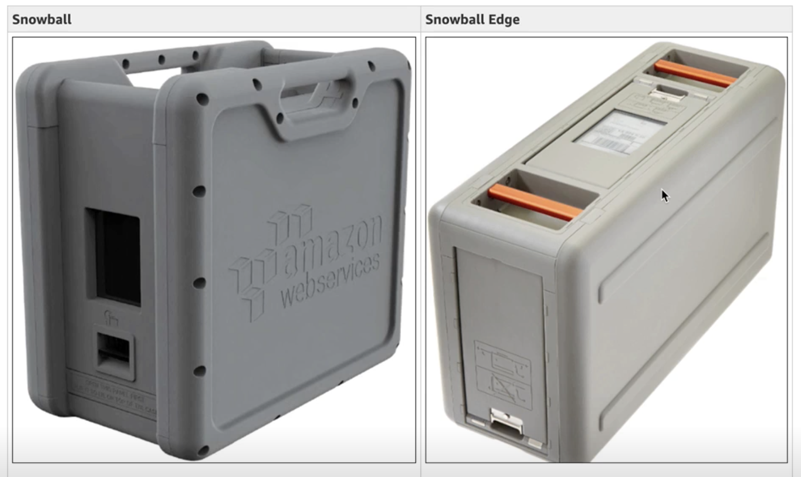

# Snowball, Snowball Edge, and Snowmobile

**Snowball**
- AWS Snowball, Snowball Edge, and Snowmobile are all products designed to allow huge data transfers in and out of AWS.
- real hardware device used to transfer huge amount of data
- snowball and snowball edge are suitcase data storages
- upload\download data from S3
- used when you have limited bandwidth
- ideal for TB or PB of data - 50GB or 80TB capacity per snowball
- you get a suitcase, saves data there, and ships it back to AWS
- all data is encrypted inside suitcase
- process takes weeks
- 10TB -> 10PB = snowball

**Snowball edge**
- gives you local compute capability
- larger capacity
- compute can be used for local instances or lambda functionality
- can be utilized when you need to process each item you put into suitcase. For example update metadata of an object
- allows to present the storage via NFS -> mounting ot instances

**Snowmobile**
- portable storage data-center within a shipping container on a semitruck
- 1 snowmobile = up to 100PB
- used when single location is 10PB+ required
- not economical when **several location** is required and **data less then 10PB**
- snowmobile comes to a data center, not in a business center
