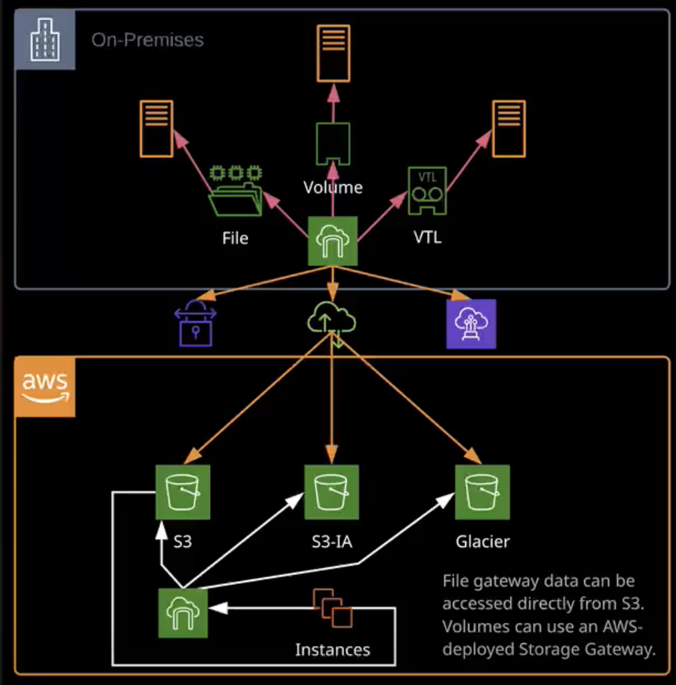

# Data and DB Migration

## AWS storage gateway

- service that allows on premises application connect to AWS cloud for data migration
- it's software that you install on your machines
- gateway types: file, volume, tape
- high level usage: download and configure, it operates over internet connection
- all gateway types use AWS storage as backend 
- works over any internet connection
- it's possible to deploy storage gateway inside your VPC
- Gateways deployed on on-prem infra
- Gateways talk to public AWS endpoints (S3, etc.)

**File Gateway**
- exposes files as SMB shares (Windows)
- SMB storage message block
- can be used for mounting to PCs
- can access files directly on S3 w/o gateway

**Volume Gateway**
- instead files you operate volumes
- I-SCSI (NAS, SAN, NTFS)
- generally for network-attached storage
- used by servers typically
- data stored locally on Gateway or cached for S3
- cannot access data from S3 directly
- can be used as EBS
- allows to take snapshots
- it's not possible to get individual files without mounting entire volume
- it's not possible to get volume data as S3 files

**Tape Gateway**
- exposes interfaces to look like a tape system
- "shelved" tapes go to AWS Glacier for long-term
- presents virtual tape drive and virtual shelf
- migrating tapes to shelf from s3 standard -> glacier

## Database migration service (DMS)

**Traditional migration:**
- do backup and restore migration -> stop all input and output on existing db -> take full backup and restore it somewhere else -> update all apps to point to a new instance
- use DB replica to copy data -> roll all new transactions on migrated DB (this functionality as a service provides DMS)

**DMS**
- allows to migrate relational DB (**to** and **from**)
- DMS: MySQL, PostgreSQL, MongoDB, Aurora, SAP, MSSQL, oracle
- **Schema Conversion Tool** (SCT) allows to transform between different DB engines as part of a migration

**Use cases:**
- When migrating a database from the AWS network to an on-premise network, or within your AWS environment.
- When needing to scale a database without downtime
- When migrating a database to and from other platforms besides AWS
- When needing a full database schema conversion
- When migrating only a portion or subset of a database

