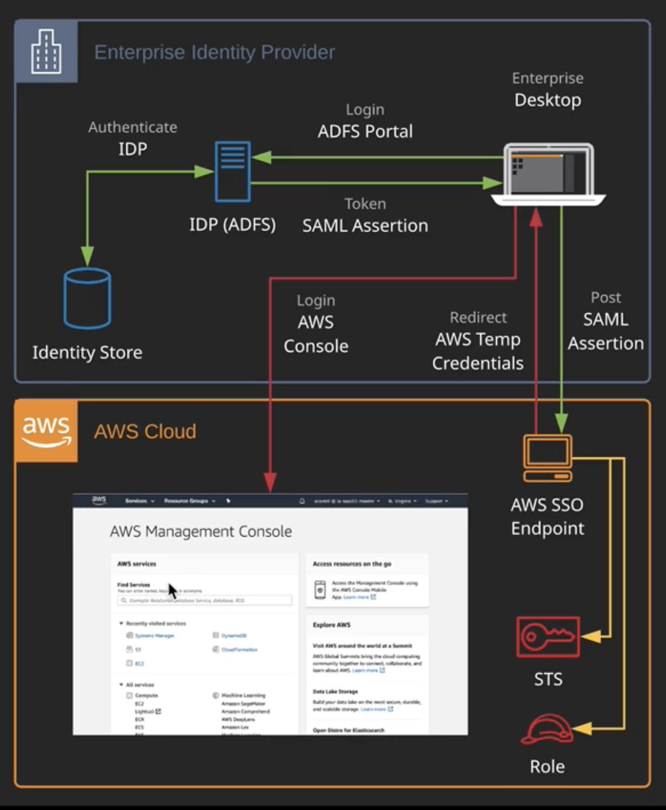
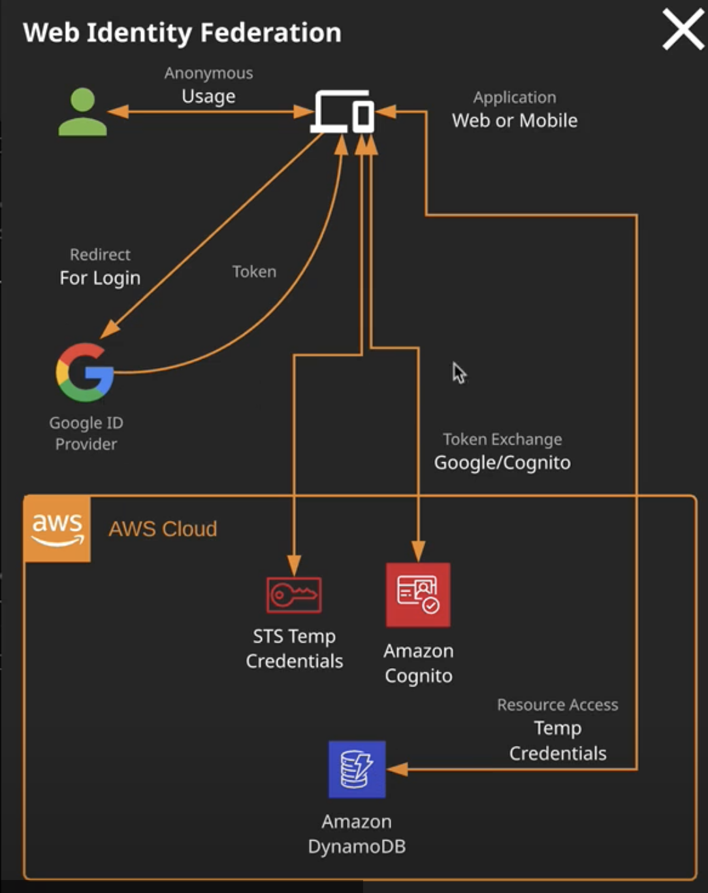

# Identity Federation and SSO

- Identity Federation (IDF) - identities of an external identity provider (IDP) are recognized
- SSO - where creds of an external identity are used to allow access to a local system (e.g. AWS)
- Identity Provider is a service providing identities. Example: Google, Azure AD

Types of IDF:
- **cross-account roles:** a remote account (IDP) is allowed to assume a role and access your account's resources
- **SAML 2.0 IDF:** an on-premises or AWS-hosted directory service instance is configured to allow AD users to log in to the AWS console
- **Web Identity Federation**: IDPs such as Google, Amazon and Facebook are allowed to assume roles and access resources in your

**Cognito** and the **Secure Token Service** are used for IDF. A federated identity is verified using an external IDP and by proving the identity is allowed to swap that ID for temporary AWS credentials by assuming a role

- SQS - product that allows to get short term creds. It generates a token when you assume a role
- cognito can broker single sign on or ID federation and create ID pools. It allows you to merge identities. Example: single person for Google, Twitter and Facebook account
- not possible to get access to AWS resources. It must be identity exchange between Identity Provider and AWS
- ADFS - active directory federation service
- it's not possible with 3rd party token to get access into a service. You need exchange 3rd token to a temp token from AWS and use that token to get access to the resources

## ID federation use case

### Enterprise Access to AWS Resources

- users have an existing pool of identities
- access to AWS resources using SSO
- potentially 1000+ users more than IAM can handle. It's a good point to use **SAML** or **Web Identity**

### Mobile and Web Applications
- mobile or web app requires access to AWS resources
- customer have other identities - Google, Twitter, Facebook and need to use those
- Could be millions or more users - beyond the capabilities of IAM. For example linux academy provides access to AWS via roles
- customers might have multiple 3rd party logins, but they represent one real person

### Centralized Identity Management (AWS Accounts)
- 
