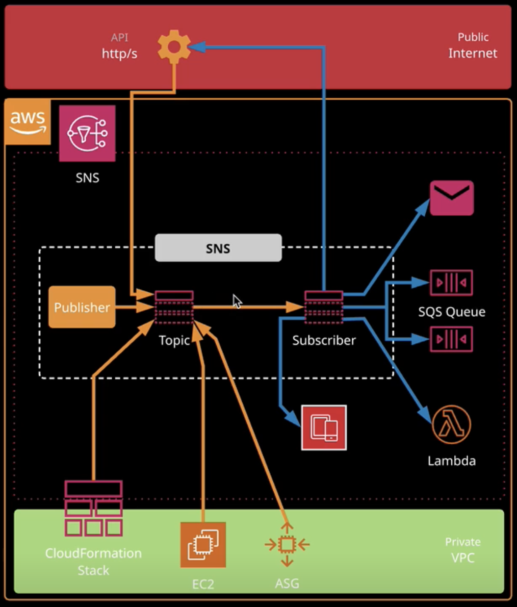
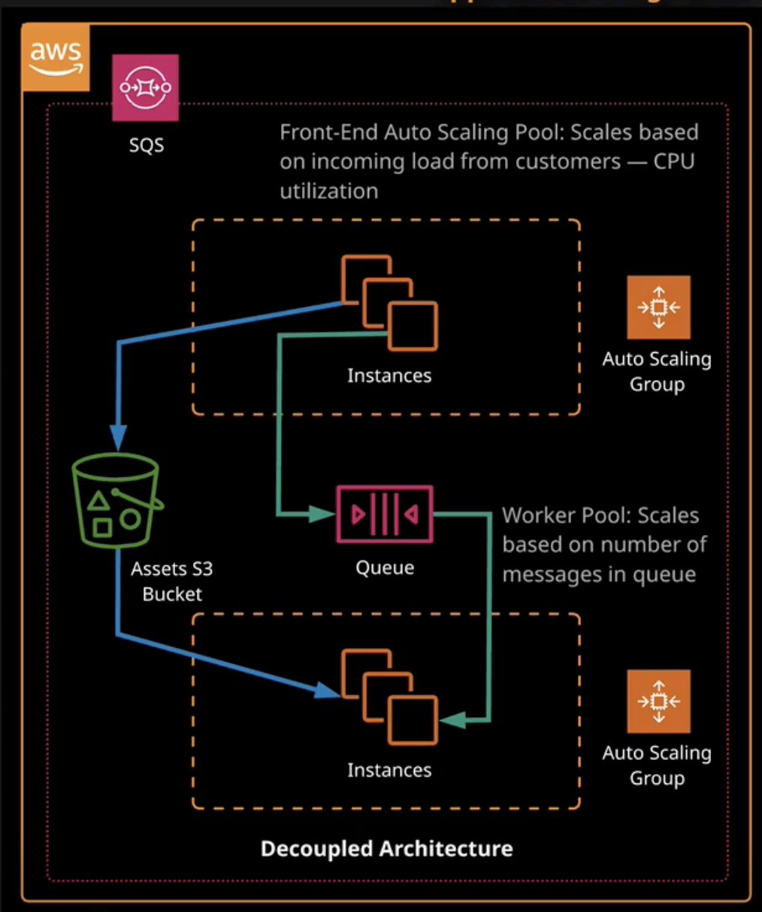

# SNS, SQS

## SNS 

- SNS simple notification service
- publisher-subscriber service. Base entity: topic
- aws service generate messages that are consumed by other subscribers
- a **publisher** can be anything: **cloudwatch**, **EC2** or **anything else**
- it's **highly reliable** product. Resilient across multiple AZs. Regional based service
- **public service**. To access it from VPC you need IGW, VPC endpoint, NAT gateway
- supports **encryption** in a rest and in a transit
- **can scale** to any high load required
- support custom message for each type of recipe
- SNS can work as mobile push platform
- possible to filter messages from topic
- **topic** - collection of message

## SQS

- SQS - simple queue service
- 1 message max 256KB, but can link larger data in S3
- **short poling** - single API call to check a queue for any messages. Returns messages. Don't wait. Request -> Response
- **long poling** - wait for some time, timeout, and then get all messages published during this time. More efficient - less empty API calls
- delete message manually from a queue after processing
- SQS types: standard and FIFO
- **standard** is near to unlimited throughput. May receive messages out of order. It's a huge wide highway. May receive more then 1 copy of a message. It guarantees that you'll get at least 1 copy of the message
- **FIFO** guarantees order and absence of duplicates.
- after polling a message gets hidden, not deleted. To delete it's necessary
- **Amazon MQ** is standards-based message broker that supports industry-standard APIs and protocols

## Elastic Transcoder

- allows to covert a media file from one format to another
- good for delivering any media files for mobile devices
- **pipeline** is queue that manage your transcoding job
- **presets** are templates that identify the settings for the transcoded media file, such as "Generic 1080p"
- **jobs** are the specified settings that aren't included in a generic preset, such as the actual file to transcoded and whether or not generate thumbnails
