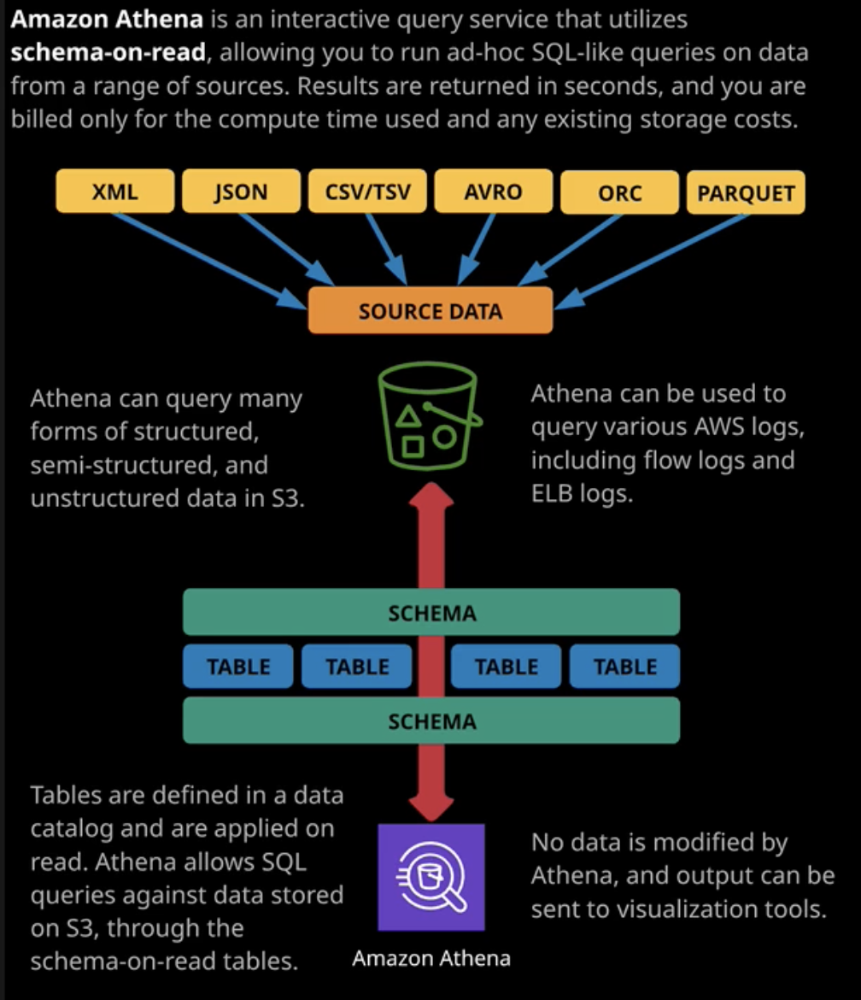

# Analytics

## Athena

- allows to query huge amount of data from S3
- paid only for data queried\transferred in S3
- athena is instead of RDS where you need to store meta info about data. Athena can query this data from original source - S3
- allows to specify structure of queried data that will be presented to you: schema
- it's not persistent storage
- it's possible to store cloud trail logs inside S3, or any other logs
- athena uses tables and views, but they are only containers where data is put
- billed for amount of data that was scanned
- querying large amount of data on fairly infrequent basis - Athena

## Elastic Map Reduce (EMR)

- allows to perform analyse of not structured or semistructared data
- based on apache hadoop ecosystem of products
- cluster based product - create nodes that work on EC2 instances
- cluster requires a shared file system
- EMR can be used for ad-hoc processing 
- node types: master, core node, task node
- master controls everything happens in a cluster. if master fails - fails everything
- master can be spot, but for ad-hoc. Usually it ondemand or reserved
- core functions: if HDFS then it manages data for it. It manages storage + task. If it fails it can affect it
- task node runs tasks only
- EMR is good for data processing workload, where you need do calculations or data manipulation

## Kinesis

- designed to process real time data
- it almost doesn't have max. performance. It's highly scalable
- **essentials**: stream, shard, data record
- **stream** - used to collect and analyze huge amount of data. It's public and accessable from within VPC and from Internet. Default data storage: 24h. Up to 7 days
- **shard** is the base throughput unit. You can add or remove shards to change throughput
- **data record** is basic entity written and read from kinesis
- supports server side encryption
- kinesis allows to store data within a period of time, but SQS doesn't
- SQS does not support processing 1 entity by many consumers
- SQS is used to decouple applications. Something produce a message, and then something consume and process it
- Kinesis is for to allow the ingestion of large scale, real time data. It takes data in, stores and after that all consumers can read the same message. Example: video uploading and changing size. Each service change the quality of video
- Queues are for messaging. Streams are used for large scale, real time streaming.
- Kinesis Data Firehouse is a separate product that can read and store data in S3. It allows to persistently store this large amount of data
- Firehouse can be integrated with the Kinesis. Producers don't need to push data to fire house, they can push to Kinesis and Firehouse will be a consumer

## Redshift

- a petabyte-scale data warehouse product
- column based DB
- used for analytics
- it's good for querying large amount of data of the same type
- row based database for transaction processing, column database for analytical processing
- redshift has a leader node and many compute nodes
- highly scalable
- athena is used to do transactional types queries for data in S3.
- EMR is used analytical actual modifications of that data
- use case: many RDS. All important data can go to redshift to allow analytic

