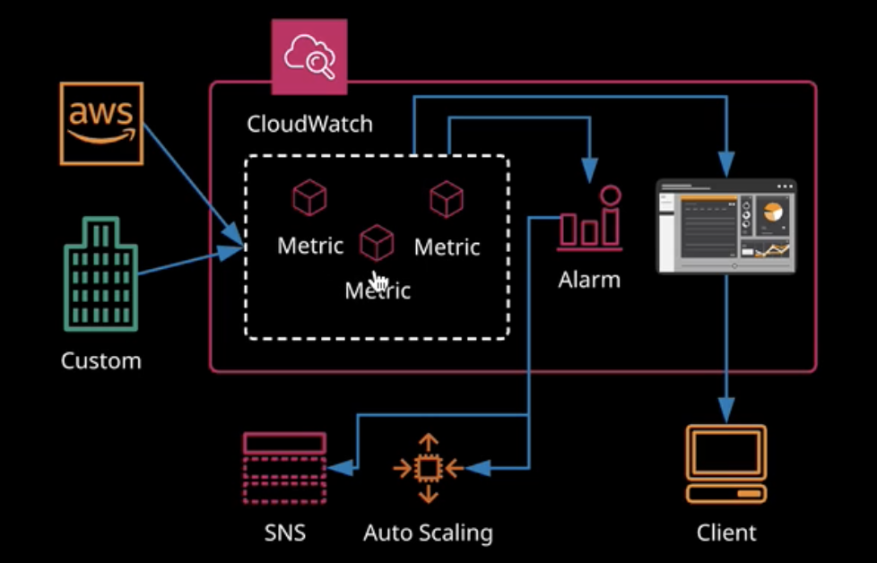
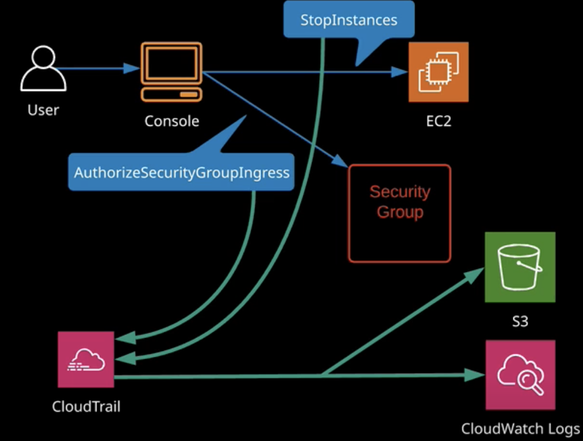

# Logging and Monitoring

## CloudWatch

- service providing near real-time monitoring of AWS products
- accepts data, converts it to metrics, and allows take action based on these alarms
- **cloud watch agent** is a program installed on concrete service that allows to publish **internal metrics** to cloud watch, that it can see by default. The agent should be installed by default because it allows to see much detailed metrics
- metics - time ordered data set
- the older data, the less granularity. Mins -> Hours -> Days
- alarms properties: **metric** (data points measured over time), **threshold** (acceptable values), **period** (how long threshold should be bad before alarm generated), **action** (what to do when alarm generated)
- alarm states: **insufficient** (not enough data to judge), **alarm** (the alarm threshold has been breached), **OK**(the threshold hasn't been breached)

### CloudWatch logs (logs)

- instead of storing alarms, it stores log events
- **log stream** - is a sequence of log events with the same source
- **log group** - a group of log stream
- logs can be streamed or exported to S3
- it's possible to install log agent that will push logs from stdout to CloudWatch logs
- how to create a metric filter: created on a log group, it pattern matches text, it creates a metric. From metric you create alarm

### CloudTrail (user actions monitoring)

- government compliance, risk management and auditing service
- cloud **trail records all actions of a role or a user**
- event history is default config of CloudTrail
- events are stored fo 90 days
- **trail** - unit of configuration. It's per region object. Allows to store logs in CloudWatch logs or S3 bucket
- enabled on all new accounts
- not real time service

### VPC Flow logs (network monitoring)

- captures traffic flowing in and out of networking within a vpc
- can be placed on a specific network interface, subnet or VPC
- flow logs don't monitor content, it monitors low level information
- flow logs of subnet monitors everything under subnet (all instances), flow logs of VPC monitors everything, logs of ec2 monitors concrete instance
- no real time
- don't capture DNS traffic, windows license activation, 169.254.169.254 (inside instance), DHCP, router traffic
