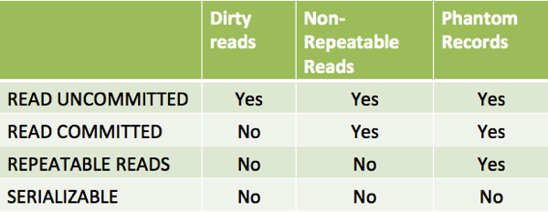

# Relational databases

Relational database is a collection of data items organized in tables. Relational databases implement 'Strong consistency' pattern of 'Consistency' patterns.

[Great article](http://coding-geek.com/how-databases-work/)

## Table of contents

1. Terms
1. Normalization
1. Indexes
1. Transactions
1. Scaling technics
1. Useful questions/answers

## Terms

**Tuple** is a row of a table

**Attribute** is a column of a table

**Database Schema** is a logical design of a database

**Database Instance** is a snapshot of the data in the db at a given instant in time

**SuperKey** is a set of attributes allowing to identify a row

**PrimaryKey** is a SuperKey selected as unique identifier of a row

**ForeignKey** is an attribute of a current table that references to the PrimaryKey another table allowing to identify concrete row in the another table

**Data-definition language (DDL)** is a set of command for defining relation schemas, deleting relations and modifying relation schemas

**Data-manipulation language (DML)** is a set of commands for selecting, inserting, updating and deleting data

## SQL

### Basics

**Types:**

- **char(n)** is a fixed length character string;
- **varchar(n)** is a variable-length character string;
- **int** is just an int 
- **smallint** is a smaller int
- **numeric(p,d)** is a fixed-point number with user-speicifed precision;
- **real, double precision** is a floating-point 
- **date** is '2001-04-25'
- **time** is '09:30:00'
- **timestamp** '2001-04-25 10:29:01.45'
- **blob** is for binary data
- **clob** is for char data

**Integrity constraints:** primary key, foreign key, not null, check (<predicate>)

> check example: `check (semester in ('Fall', 'Winter', 'Spring', 'Summer')`

**Agreagte functions** like 'AVG' or 'SUM', are functions accepting a collectio of rows and returning a single value

### Operators

`LIKE` is a pattern matching operator. The `%` matches any substring. The `_` matches any character.

Examples: 
```sql
- 'Intro%' matches any string beginning with "Intro"
- '%Comp%' matches any string containing "Comp" as a substring, for example, 'Intro. to Computer Science', and 'Computational Biology'
- '___' matches any string of exactly three characters
- '___%' matches any string of at least three characters
```

`ORDER BY` is a sort operator. By default is ASC order (from A to Z). Can be used to order multiple columns: `...ORDER BY salary DESC, name ASC`

`BETWEEN` is an operator specifying that a value be less than or equal to some value and greater than or equal to some other value. `salary BETWEEN 90000 AND 100000` is same as `salary <= 100000 and salary >= 90000`

`UNION` is an operator joining results of different SELECT queries. In addition automatically eliminates duplicates

`INTERSECT` is an operator returning common only common results from different queries

`EXCEPT` is an operator eliminating results that exist in the next result

`DISTINCT` is an operator eliminating duplicates in the result of SELECT statement

`GROUP BY` is an operator grouping sets of tuples and allowing to apply an aggregate function to each group of tuples

`HAVING` is an operator applying to a group of tuples. Similar as WHERE but works with a group of tuples

> Tuple comparison in SQL `WHERE (instructor.ID, dept_name) = (teaches.ID, 'Biology')`

## Indexes

Index is basically a list of where certain data points are

An index can be **clustered** or **non clustered**:
- A clustered index organizes data. An item of index contains data;
- A non clustered index points to concrete data. An item of index has a link to data;

In addition there is a clustered index that just combines 2 columns

Usually a primary key is a clustered index


[Source of information](https://habr.com/ru/post/247373/)

## Transactions

Transaction is unit of work performed within database management system.

ACID principles [source](https://searchsqlserver.techtarget.com/definition/ACID):

- **Atomicity.** Means that you can guarantee that all of a transaction happens, or none of it does.
- **Consistency.** Means that you guarantee that your data will be consistent; none of the constraints you have on related data will ever be violated.
- **Isolation.** Means that one transaction cannot read data from another transaction that is not yet completed.
- **Durability.** Means that once a transaction is complete, it is guaranteed that all of the changes have been recorded to a durable medium (such as a hard disk).

Levels of isolation: 
- Serializable. Each transaction has complete own world.
- Repeated read (phantom read). Anomaly: if TX A does 'SELECT COUNT(1) FROM TABLE_X' and then a new data is added and committed in TABLE_X by TX B, if TX A does againg a count (1) the value won't be the same.
- Read committed (non-repeatable read).
- Read uncommitted (dirty read).

## Scaling technics

**Scaling** is the process of increasing or decreasing the capacity of the system by changing the number of processes available to service requests. **Scalability** is when we add resources to a server, we improve performance.

**Replication** is copying of data to other server.

**Master replica** is a server that can read and write.

**Slave replica** is a server that can only read.

**Server cluster** is a group of servers working as single instance.

### Replications

**Master-slave** replication is approach when there's a master and many slaves. When master shuts down the server allows only reading until a slave is not promoted to master.

Disadvantage: logic and delay for promoting a slave to master is required.

**Master-master** allows writing and reading to each instance. If a master goes down, another master can continue handling of request.

Disadvantages:

- A load balancer or additional logic in your app is required to determine where to write;
- Most master-master systems are either loosely consistent (violating ACID) or have increased write latency due to synchronization.
- Conflict resolution comes more into play as more write nodes are added and as latency increases.

Disadvantages of replications:

- There is a potential for loss of data when the master fails before any newly written data can be replicated to other nodes;
- If there are a lot of writes, the read replicas can get bogged down with replaying writes and can't do as many reads;
- The more read slaves, the more you have to replicate (leads to greater replication lag).
- On some systems, writing to the master can spawn multiple threads to write in parallel, whereas read replicas only support writing sequentially with a single thread.
- Replication adds more hardware and additional complexity.

### Federation

**Federation** (or functional partitioning) splits up databases by function. For example, instead of a single, monolithic database, you could have three databases: forums, users, and products.

Disadvantages of federation:

- federation is not effective if your schema requires huge functions or tables.
- you'll need to update your application logic to determine which database to read and write.
- joining data from two databases is more complex with a server link.

### Sharding

**Sharding** distributes data across different databases such that each database can only manage a subset of the data. Taking a users database as an example, as the number of users increases, more shards are added to the cluster.

Disadvantages of federation:

- You'll need to update your application logic to work with shards, which could result in complex SQL queries;
- Data distribution can become lopsided in a shard. For example, a set of power users on a shard could result in increased load to that shard compared to others;
- Joining data from multiple shards is more complex.

### Denormalization

**Denormalization** attempts to improve read performance at the expense of some write performance. Redundant copies of the data are written in multiple tables to avoid expensive joins. Some RDBMS such as PostgreSQL and Oracle support materialized views which handle the work of storing redundant information and keeping redundant copies consistent.

Disadvantages of denormalization:

- Data is duplicated.
- Constraints can help redundant copies of information stay in sync, which increases complexity of the database design.
- A denormalized database under heavy write load might perform worse than its normalized counterpart.

### SQL tuning

It's important to benchmark and profile to simulate and uncover bottlenecks.

**Benchmark** - Simulate high-load situations with tools such as ab.

**Profile** - Enable tools such as the slow query log to help track performance issues.

[TBD](https://github.com/donnemartin/system-design-primer#sql-tuning)

## Useful questions/answers

**When to open/close connection to database?**

> Keep connections for a long time, but keep transactions as short as possible.
> Don't open and close connections too often. Hang onto them, but be prepared for them to vanish out from under you.

**What is optimistic and pessimistic concurrency?**

- Pessimistic involves locking rows
- Optimistic Locking is a strategy where you read a record, take note of a version number (other methods to do this involve dates, timestamps or checksums/hashes) and check that the version hasn't changed before you write the record back.

**Concurrency effects**



- READ_UNCOMMITTED - one transaction may see uncommitted changes made by some other transaction
- READ_COMMITTED (DEFAULT) - guarantees that any data read was committed at the moment is read
- REPEATABLE READS - it guarantees that any data read cannot change and it's committed
- SERIALIZABLE - based on pessimistic concurrency control where transactions are completely isolated from one another

- Dirty read - a dirty read is the situation when a transaction reads a data that has not yet been committe
- Nonrepeatable read - read occurs when a transaction reads same row twice, and get a different value each time. It happens when you see successfully committed changes when performing the same query multiple times
- Phantom reads - two identical queries are executed, and the collection of rows returned by the second query is different from the first.
