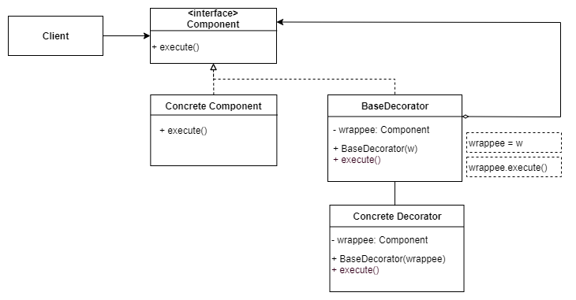

# Design patterns of gang of four

Design patterns are typical solutions to commonly occurring problems in software design

Patterns of gang of four are separated on three groups: creation, structural and behavioral patterns

**Behavioral** patterns take care of effective communication and the assignment of responsibilities between objects

## Table of content

1. Creational patterns
1. Structural patterns
1. Behavioral patterns

## Creational patterns

Creational patterns provide object creation mechanisms that increase flexibility and reuse of existing code

### Factory

**Explanation:** factory creates an instance for a client without exposing any instantiation logic to the client

**Use case (problem):** when creation of an object involves some logic. You can move creational code to a separate class and reuse the factory class across whole solution

**Benefit:** allows to reduce code duplication, simplifies code base, single responsibility principle, open-clise principle

;

### Abstract factory

**Explanation:** abstract factory groups related factories to produce related products

**Use case (problem):** when you need to hide several factories for creation of a group of related objects

**Benefit:** simplifies code base, single responsibility principle, open-clise principle

;

### Builder

**Explanation:** builder allows to create different flavors of an object avoiding constructor pollution

**Use case:** when there is a type with many parameters that has to be initialized with constructor. For example, there's a builder of a server when you create ASP.NET Core app

**Benefit:** allows to avoid 'Long Parameter List' in client's code smell

;

### Prototype

**Explanation:** creates a clone of an existing object

**Use case:** when you have an object with many parameters and you need to a get another one with the same state

**Benefit:** allows a client easily create a copy of the same type

;

### Singleton

**Explanation:** makes sure that only one instance of a class is created

**Use case:** when you need to have only 1 instance of an object across whole application

**Benefit:** you are sure that you have only one instance

;

## Structural patterns

Structural patterns explain how to compose objects and classes into larger structures and keep the structures flexible

### Adapter

**Explanation:** a wrapper that binds two incompatible types

**Use case:** your app works with json. One of types can produce only XML. It's possible to write an adapter to convert XML to JSON

**Benefit:** ensures single responsibility and open closed principles

;

### Bridge

**Explanation:** the pattern is about using composition over inheritance. Implementation details are push from a hierarchy to another object with a separate hierarchy

**Use case:** let's say you need to implement themes for web pages. Instead of creating different pages, you can inject colors configuration to a separate type

**Benefit:** it's possible to change behavior on fly, you have a separate hierarchy that you can modify

;

### Composite

**Explanation:** composite allows to organize tree based data structures. For client it looks like it works only with one instance of an object instead of tree

**Use case:** when you want the client code to treat both simple and complex elements uniformly. All elements defined by the Composite pattern share a common interface

**Benefit:** client doesn't need to know about kind of instance it works with: a simple one or complex containing children

;

### Decorator 

**Explanation:** decorator allows dynamically attach a new behavior to object by placing these objects inside special wrapper objects that contain the behavior

**Use case:** when it's necessary to add behavior in runtime

**Benefit:** you can extend object's behavior without making a new sub classes, it's possible to combine several behaviors by wrapping an object into multiple decorators

;

### Facade 

**Explanation:** a pattern that allows to simplify a complex set of types

**Use case:** it's possible to use Facade when you have a set functions that you need to call together. Facade allows hide this details from a client

**Benefit:** You can isolate your code from the complexity of a subsystem

;

### Flyweight

**Explanation:** allows to minimize memory usage by 

**Use case:** when your program must support a huge number of objects which barely fit into available RAM

**Benefit:** save lots of RAM, assuming your program has tons of similar objects

> The idea is to reuse same instance of immutable objects. Let's say that you have a type with properties which values are duplicated across instances. You can create a separate class with those properties and reuse them

### Proxy

**Explanation:** a proxy is substitution of another object with additional functionality. Proxy implements same contract but extends the functionality

**Use case:** unit of work is proxy, caching service is proxy

**Benefit:** open\closed principle, adding additional details

## Behavioral

## Chain of responsibility

**Explanation:** allows to pass a request along a chain of handlers. If a handler can process a request then it handles it

## Command

**Explanation:** the pattern allows to transform a request into a stand-alone object containing information about request. Command allows to delay or queue a request's execution and provide undoable operation

## Iterator

**Explanation:** allows to traverse a collection without exposing its underlying representation

## Mediator

**Explanation:** it's a third party object that controls the interaction between two objects. It helps reduce the coupling between the classes communicating with each other

## Memento

**Explanation:** lets you save and restore the previous state of an object without revealing the details of its implementation

## Observer

**Explanation:** lets you define a subscription mechanism to notify multiple objects about any events that happen to the object they're observing

## State

**Explanation:** lets an object alter its behavior when its internal state changes

## Strategy

**Explanation:** lets define a family of algorithms, put each of them into a separate class, and make their objects interchangeable

## Template Method

**Explanation:** defines the skeleton of an algorithm in the superclass but lets subclasses override specific steps of the algorithm without changing its structure

## Visitor

**Explanation:** 
