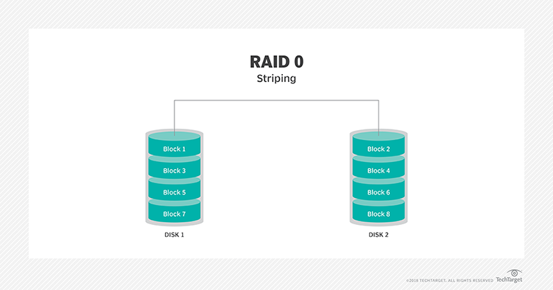
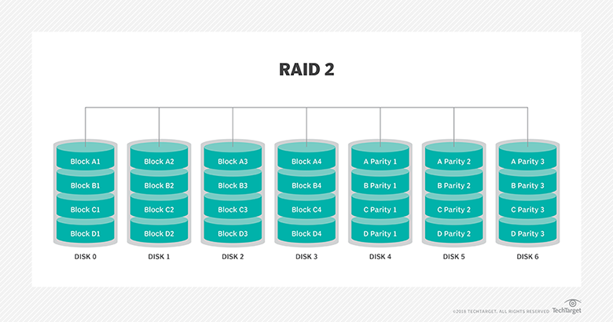
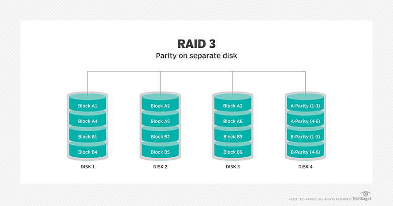
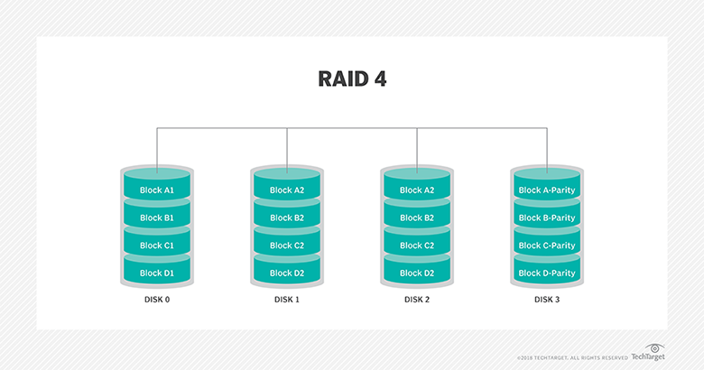

# Distributed systems

[Source of information](https://github.com/donnemartin/system-design-primer)

## Terms

**Sharding** distributes data across different databases such that each database can only manage a subset of the data.

**Vertical scaling** adds more resources (CPUs or RAM) to a machine or improving algorithms that does computation.

Disadvantage: requires more expensive hardware;

**Horizontal scaling** adds more machines.

Disadvantage:

- Scaling horizontall involves cloning servers (more complexity);
    - Servers should be stateless (no user-related data like sessions or profile pictures);
    - Sessions can be stored in a centralized data store (SQL, NoSQL, Redis, Memcached);
- Downstream servers such as caches and databases need to handle more simultaneous connections as upstream servers scale out;

**Replication** - Copying an entire table or database onto multiple servers. Used for improving speed of access to reference records such as master data.

**Partitioning** Splitting up a large monolithic database into multiple smaller databases based on data cohesion. Example - splitting a large ERP database into modular databases like accounts database, sales database, materials database etc.

**Clustering** using multiple application servers to access the same database. Used for computation intensive, parallelized, analytical applications that work on non volatile data.

**Sharding** splitting up a large table of data horizontally i.e. row-wise. A table containing 100s of millions of rows may be split into multiple tables containing 1 million rows each. Each of the tables resulting from the split will be placed into a separate database/server. Sharding is done to spread load and improve access speed. Facebook/twitter tables fit into this category.

**Sticky session** is feature of many commercial load balancing solutions for web-farms to route the requests for a particular session to the same physical machine that serviced the first request for that session.

**Scalability** is when we add resources to a server, we improve performance.

> If you have a **performance problem**, your system is **slow for a single user**.
> If you have a **scalability problem**, your system is **fast for a single** user but **slow under heavy load**.

**Latency** is the time to perform some action or to produce some result.

**Throughput** is the number of such actions or results per unit of time.

> Generally, you should aim for maximal throughput with acceptable latency.

**TTL** is time to live.

**DNS** translates a domain name such as www.example.com to an IP address. When you enters an URL in browser, the browser first asks DNS about IP of requested server and only after that start sending of packages directly to the server.

## CAP theorem

**Availability:** every request receives a response (no 500 allowed), without guarantee that it contains the most recent version of the information

**Consistency:** every read receives the most recent write or an error.

**Partition tolerance:** any given request can be completed even if a subset of nodes in the system are unavailable.

To achieve P, we needs replicas. The more replicas we keep, the better the chances are that any piece of data we need will be available even if some nodes are offline.

To achieve A, we need no single point of failure. That means that "master/slave" replication configurations doesn't work since the master/primary is a single point of failure. We need to go with multiple master configurations. To achieve absolute "A", any single replica must be able to handle reads and writes independently of the other replicas. (in reality we compromise on async, queue based, quorums, etc)

To achieve C, we need a "single version of truth" in the system. Meaning that if I write to node A and then immediately read back from node B, node B should return the up-to-date value. Obviously this can't happen in a truly distributed multi-master system.

In case of netsplit we have 2 separate parts of application:

- 1 part continues working and another part is shut down (loose availability);
- Both parts work (loose consistency). In this case we will have 2 different applications that live independently;

> Networks aren't reliable, so you'll need to support partition tolerance. You'll need to make a software tradeoff between consistency and availability.

CAP allows 3 cases in designing of system

**CP**. Consistency + Partition tolerance refers to systems designed according to ACID principles. Example is RDBMS. Example of algorithm: paxos&raft.

> Waiting for a response from the partitioned node might result in a timeout error. CP is a good choice if your business needs require atomic reads and writes.

**AP**. Availability + partition tolerance refers to systems designed according to BASE philosophy. Example of algorithm: gossip.

> Responses return the most recent version of the data available on a node, which might not be the latest. Writes might take some time to propagate when the partition is resolved.
> AP is a good choice if the business needs allow for eventual consistency or when the system needs to continue working despite external errors.

**AC**. Availability + Consistency. AC guaranties we have highly availability and consistency until the network wasn't broken. Example of algorithm: 2 phase commit.

### Consistency patterns

Definition of consistency: Every read receives the most recent write or an error.

#### Weak consistency

After a write, reads may or may not see it.

For example: if you are on a phone call and lose reception for a few seconds, when you regain connection you do not hear what was spoken during connection loss.

#### Eventual consistency

After a write, reads will eventually see it (typically within milliseconds). Data is replicated asynchronously.

This approach is seen in systems such as DNS and email. Eventual consistency works well in highly available systems.

#### Strong consistency

After a write, reads will see it. Data is replicated synchronously.

This approach is seen in file systems and RDBMSes. Strong consistency works well in systems that need transactions.

### Availability patterns

#### Fail-over

**Failover** when one machine fails, another machine (usually in the same location) takes over and resumes service. There are 2 approaches 'active-passive' and 'active-active'

**Active-passive**. Heartbeats are sent between the active and the passive server on standby. If the heartbeat is interrupted, the passive server takes over the active's IP address and resumes service. Like 'master-slave'.

**Active-active**. Both servers are managing traffic, spreading the load between them. Like 'master-master'.

#### Replication

**Replication** - copying an entire table or database onto multiple servers. Used for improving speed of access to reference records such as master data.

2 types of replications:

- Master-master
- Master-slave

## CDN

**CDN** (content delivery network) is a globally distributed network of proxy servers, serving content from locations closer to the user.

Pros:

- Users receive content at data centers close to them;
- Your servers do not have to serve requests that the CDN fulfills.

Cons:

- CDN costs could be significant depending on traffic;
- Content might be outdated if it is updated before the TTL expires it;
- CDNs require changing URLs for static content to point to the CDN.

**Push CDNs** receive new content whenever changes occur on your server. You take full responsibility for providing content, uploading directly to the CDN and rewriting URLs to point to the CDN. (Means that you update the CDN manually)

**Pull CDNs** grab new content from your server when the first user requests the content. You leave the content on your server and rewrite URLs to point to the CDN. This results in a slower request until the content is cached on the CDN. (Means that CDN is updated automatically)

## Load balancer

**Load balancers** distribute incoming client requests to computing resources such as application servers and databases.

Responsibilities:

- preventing requests from going to unhealthy servers
- preventing overloading resources
- helping eliminate single points of failure

Bonuses:

- SSL termination. Decrypt incoming requests and encrypt server responses so backend servers do not have to perform these potentially expensive operations. Removes the need to install X.509 certificates on each server.
- Session persistence. Issue cookies and route a specific client's requests to same instance if the web apps do not keep track of sessions. (Stick session)

Metrics that used by load balancer:

- Random;
- Least loaded;
- Session/cookies;
- Round robin;
- Layer 4 (analyses headers and redirect requests based on info about IP);
- Layer 7 (analyses content. Can redirect requests containing video to specific headers);

Disadvantages:

- The load balancer can become a performance bottleneck if it does not have enough resources or if it is not configured properly;
- Introducing a load balancer to help eliminate single points of failure results in increased complexity;
- A single load balancer is a single point of failure, configuring multiple load balancers further increases complexity.

## Reverse proxy

**Reverse proxy** is a web server that centralizes internal services and provides unified interfaces to the public.

Benefits:

- Increased security - hide information about backend servers, blacklist IPs, limit number of connections per client
- Increased scalability and flexibility - clients only see the reverse proxy's IP, allowing you to scale servers or change their configuration
- SSL termination - decrypt incoming requests and encrypt server responses so backend servers do not have to perform these potentially expensive operations
- Removes the need to install X.509 certificates on each server
- Compression - Compress server responses
- Caching - Return the response for cached requests (HTML\CSS\JS, images, videos)

- Load balancer is for multiple servers;
- Reverse proxy is for single server;

## RAID

**RAID** is redundant array of independent disks. RAID (redundant array of independent disks) is a way of storing the same data in different places on multiple hard disks to protect data in the case of a drive failure.

**Stripe** is collection of disks.
**Mirror** is a copy of disks.
**Parity** is information about data stored in stripes and disks. If one stripe falls, you can calculate it using parity information in other stripes.

RAID has 6 levels (0-5).

**RAID 0** configuration has striping, but no redundancy of data. It offers the best performance, but no fault tolerance.

**RAID 1** configuration consists of at least two drives that duplicate the storage of data. There is no striping. Read performance is improved since either disk can be read at the same time. Write performance is the same as for single disk storage.

**RAID 2** configuration uses striping across disks, with some disks storing error checking and correcting (ECC) information. It has no advantage over RAID 3 and is no longer used.

**RAID 3** technique uses striping and dedicates one drive to storing parity information. The embedded ECC information is used to detect errors. Data recovery is accomplished by calculating the exclusive OR (XOR) of the information recorded on the other drives. Since an I/O operation addresses all the drives at the same time, RAID 3 cannot overlap I/O. For this reason, RAID 3 is best for single-user systems with long record applications.

**RAID 4** uses large stripes, which means you can read records from any single drive. This allows you to use overlapped I/O for read operations. Since all write operations have to update the parity drive, no I/O overlapping is possible. RAID 4 offers no advantage over RAID 5.

**RAID 5** level is based on block-level striping with parity. The parity information is striped across each drive, allowing the array to function even if one drive were to fail. The array's architecture allows read and write operations to span multiple drives. This results in performance that is usually better than that of a single drive, but not as high as that of a RAID 0 array. RAID 5 requires at least three disks, but it is often recommended to use at least five disks for performance reasons.

RAID 5 arrays are generally considered to be a poor choice for use on write-intensive systems because of the performance impact associated with writing parity information. When a disk does fail, it can take a long time to rebuild a RAID 5 array. Performance is usually degraded during the rebuild time, and the array is vulnerable to an additional disk failure until the rebuild is complete.

