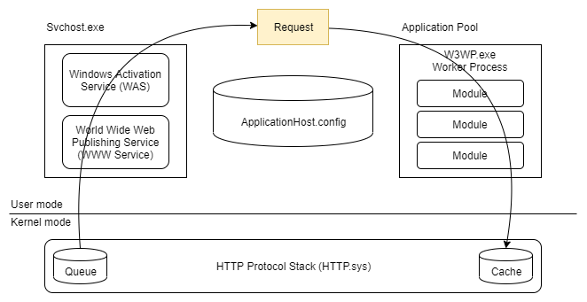
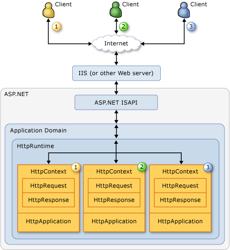

# ASP.NET Framework

ASP.NET is a framework for building web and service apps.

## IIS7 Architecture

IIS is internet information server is a web server for use with the Windows NT operating systems.

Main components of IIS:
- HTTP.SYS - driver that listen to HTTP requests;
- WWW Service - adapter for HTTP.SYS;
- WAS(Windows Process Activation Service) - manages working processes and configure pool of applications;

HTTP.SYS is a driver and works on the level of OS. Main goal of the driver is to listen to requests and put them to appropriate queue belonging to an application.

WWW Service is an adapter between HTTP.SYS and WAS.

WAS is a service configuring and managing pool of applications. WAS reads configuration from ApplicationHost.config on start application.



Request life cycle on IIS level:
1. HTTP.SYS receives a request for the first time for specific site that exists in the ApplicationHost.config;
1. HTTP.SYS asks the WAS service via WWW adapter to define the application that can process a message. WAS returns result and HTTP.SYS creates a queue of requests for specific application and the cache for responses;
1. WAS service deploys ASP.NET application with specified modules in ```ApplicationHost.config``` in the app pool during configuring HTTP.SYS. ASP.NET application is one of the modules;
1. Finally request goes through all modules of started application and the application returns response.

## ASP.NET Application life cycle



Application life cycle:
1. A host receives request;
1. IIS checks if it can return a static html page for the request, if it can then it returns it else it passes the request to ASP.NET ISAPI (internet server application programming interface);
1. ASP.NET ISAPI asks ASP.NET Application manager to process this request. ASP.NET App manager creates a separate domain for each site and runs it there. Each domain contains an instance of HostEnvironment with information about application ; 
1. Each site or web application works in a separate domain of ASP.NET process;
1. Each client's request converts to HttpContext object;
1. For each HttpContext is allocated an instance of separate HttpApplication that. Also the HttpApplications are reused;
1. HttpApplication manages execution of a request and returns result;

> Note: IIS has 2 modes classic and integrated. Classic allows to return an html page without accessing running asp.net app. Integrated doesn't separate requests and just allows an asp.net app to return any result including static resources.

**Hosting models (for dotnet core)**

There are 2 types of hosting models: in-process and out of process. In-process has better performance since it's necessary to send requests through adapter.
