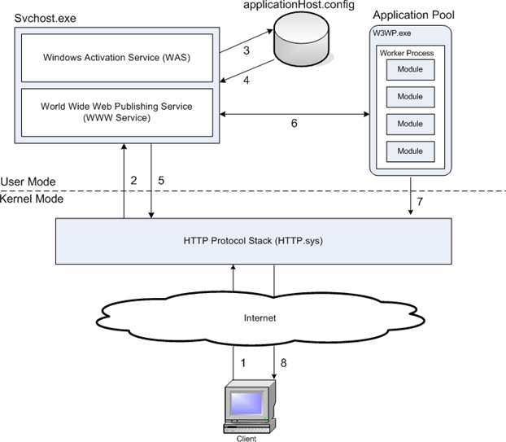

# IIS

IIS (Internet Information Services) is a web server from Microsoft that runs on Windows systems

## IIS Architecture

Main components of IIS:
- HTTP.SYS - driver that listen to HTTP requests;
- WWW Service - adapter for HTTP.SYS;
- WAS(Windows Process Activation Service) - manages working processes and configures pool of applications.

**HTTP.SYS** is a driver and works on the level of OS. Main goal of the driver is to listen to requests and put them to appropriate queue belonging to an application

HTTP.SYS responsibilities:
- kernel-mode caching;
- kernel-mode request queuing;
- request pre-processing and security filtering.

**WWW Service** is an adapter between HTTP.SYS and WAS

WWW Service responsibilities (before IIS 7):
- HTTP administration and configuration. WWW starts, stops, monitors, and manages worker processes that process HTTP requests;
- Process management. Manages app pools, worker processes (starting, stopping recycling). Monitors health and invokes rapid fail detection;
- Performance monitoring. It monitors performance and provides performance counters for Web sites and for the IIS cache;

**WAS** is a service configuring and managing pool of applications. In IIS 7 and later, it manages application pool configuration and worker processes instead of the WWW Service. This enables you to use the same configuration and process model for HTTP and non-HTTP sites.

### Request life cycle on IIS level

1. When a client browser initiates an HTTP request for a resource on the Web server, HTTP.sys intercepts the request;
1. HTTP.sys contacts WAS to obtain information from the configuration store;
1. WAS requests configuration information from the configuration store, applicationHost.config;
1. The WWW Service receives configuration information, such as application pool and site configuration;
1. The WWW Service uses the configuration information to configure HTTP.sys;
1. WAS starts a worker process for the application pool to which the request was made;
1. The worker process processes the request and returns a response to HTTP.sys;
1. The client receives a response.

### General ASP.NET Application life cycle

Details of HTTP request inside of w3wp.exe:
- a request passes through several ordered steps, called events;
- each event corresponds to a native module that process request;
- if processing requires a managed module, then the process creates a domain;

### Application pools in IIS

There many asp.net sites that runs together. Each site has own **app domain**.

Each site is assigned to one **application pool**. Many sites can have same pool.

Each pool can have 1 or more **worker process**. Each worker process is a separate process.

Modes of app pools: integrated and classic.

In the integrated mode, the request-processing models of IIS and ASP.NET are integrated into a unified process model. This model eliminates steps that were previously duplicated in IIS and ASP.NET, such as authentication. Additionally, Integrated mode enables the availability of managed features to all content types.

In the classic app pool mode, ASP.NET requests first go through native processing steps in IIS and are then routed to Aspnet_isapi.dll for processing of managed code in the managed runtime. Finally, the request is routed back through IIS to send the response.

**Hosting models (for dotnet core)**

There are 2 types of hosting models: in-process and out of process. In-process has better performance since it's necessary to send requests through adapter.

