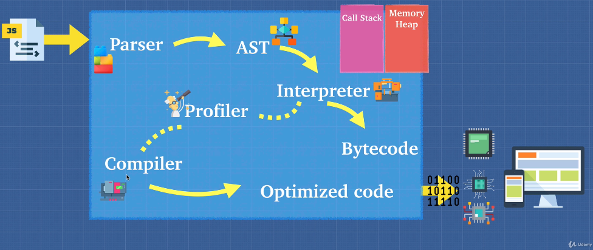
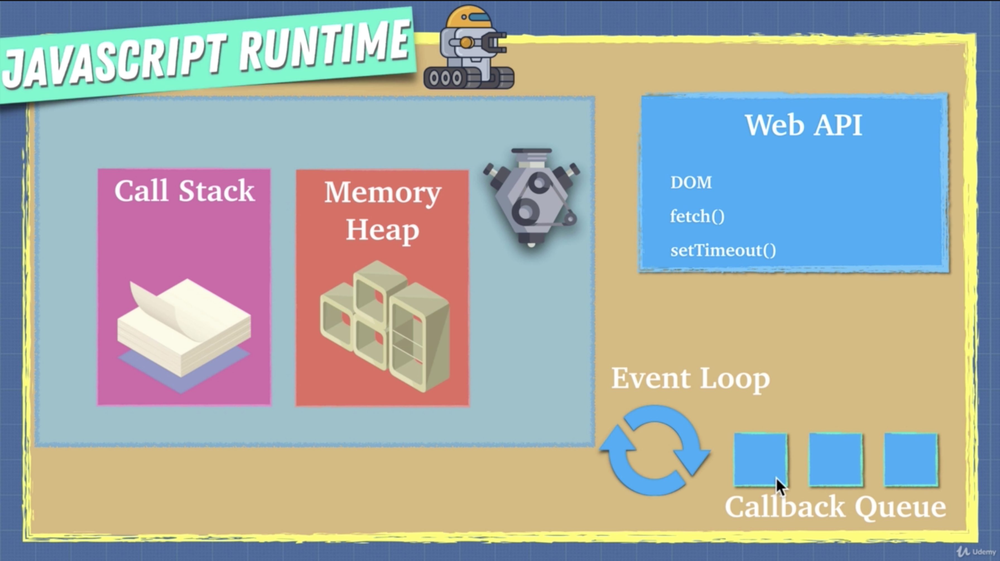
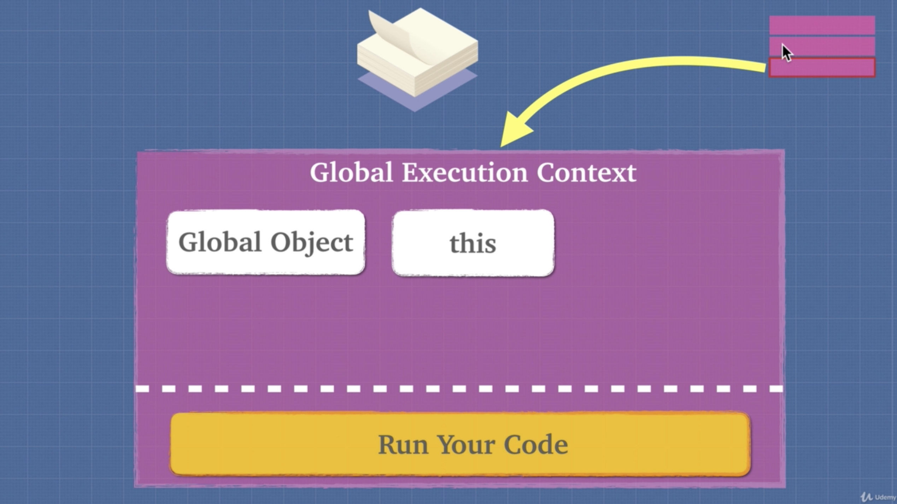

# JS internals

Notes written basing on [Advanced JavaScript Concepts course](https://www.udemy.com/advanced-javascript-concepts)

## JavaScript environment foundation

**JS engine**

JS is interpreting and single threading languages using callbacks. JS engine is a mechanism that understands JS and tells PC what to do (similar to CLR). There are a lot of JS engines (ECMAScript engines). 

For example: 
- Chrome V8 engine is a JS engine developed by The Chromium Project for Google Chrome and Chromium browser. Also Node.JS uses Chrome V8 engine. V8 engine doesn't generate any intermediate code and compiles JS directly into machine code
- SpiderMonkey is developed by Brendan Eich and currently used by FireFox. This's the very first JS engine

ECMA is European Computer Manufacturer's Association is a non-profit organization that develops standards. 

The difference between ECMA script and JS is that JS is an implementation of the ECMAScript standard. For example ECMA Standard is standard for JavaScript (Netscape) and JScript (Microsoft)

Under the hood of JS engine does following:
1. JS file as input
1. Parser breaks the JS code on tokens. Each token explains what code trying to do
1. AST (astexplorer.net allows to see how JS is transformed into AST)
1. Interpreter () -> bytecode that can be executed by PC
1. Profiler takes bytecode and checks how it runs and finds ways to optimize it
1. Compiler
1. Optimized code



Babel + TS: Babel is compiler of js that takes modern js and translates it to a browser compatible JS

Compiler vs Interpreter:
- Interpreter allows to start executing of code faster but it becomes slow when it runs a lot of code
- Compiler can do optimizations so many lines of code is not a problem for compiler but it requires some time to execute program

JIT compiler is combination of compiler and interpreter and it provides cons from both compiler and interpreter worlds

Dangerous mechanisms\functions that my hurt performance of JS app:
- eval() - is not good because it changes lexical scope of a function
- arguments
- for in
- with - is not good because it changes lexical scope of a function
- delete
- hidden classes. A technique used by V8 to identify a type of objects. If you add a new property to a JS object then you V8 produces a new hidden class. Too many new properties for existing types = new hidden = worse performance;
- inline caching. Inline Cache can be treated as a fast path (shortcut) to the value/property

WebAssembly is standard binary executable format. It's a bytecode that can run on browsers. Many languages including C++ can be compiled to Web assembly.

Execution context is an abstract concept that holds information about the environment within which the current code is being executed.

Memory leaks: 
- Global variables;
- Adding new eventListeners without removing them;
- Using setInterval without clearing;

### JS garbage collector

JScript uses a nongenerational mark-and-sweep garbage collector. It works like this:

- Every variable which is "in scope" is called a "scavenger". A scavenger may refer to a number, an object, a string, whatever. We maintain a list of scavengers -- variables are moved on to the scav list when they come into scope and off the scav list when they go out of scope.
- Every now and then the garbage collector runs. First it puts a "mark" on every object, variable, string, etc – all the memory tracked by the GC. (JScript uses the VARIANT data structure internally and there are plenty of extra unused bits in that structure, so we just set one of them.)
- Second, it clears the mark on the scavengers and the transitive closure of scavenger references. So if a scavenger object references a nonscavenger object then we clear the bits on the nonscavenger, and on everything that it refers to. (I am using the word "closure" in a different sense than in my earlier post.)
- At this point we know that all the memory still marked is allocated memory which cannot be reached by any path from any in-scope variable. All of those objects are instructed to tear themselves down, which destroys any circular references.

GC marks all reachable object and removes all un marked. Optimization: generational, incremental (partial), idle-time collection

### JS runtime and engine

JS is single threaded programming language. All single threaded programs have only one call stack. Also JS is synchronous.

JS runtime consists of:
- JS engine;
- Web browser API (DOM, fetch(), setTimeout());
- Event Loop with callback queue;

Event loop pushes callbacks to queue only when the main flow has been executed



Runtime VS Engine:
- JS file is musician notes
- JS engine is a musician
- JS runtime is a musician + notes + a lot of other instruments


Node.JS is js runtime

Example of runtime:


Node.JS has a global API

## JavaScript executing environment

**Execution context**

Execution context is created for each method invocation. Initially JS creates a global execution context. All JS code is run in execution context

When JS creates a global execution context it gives you a global object and `this`. In browser global object is `window`. `window` === `this` is true. When a developer assigns a variable, the variable becomes a property of global object.

```js
var example = 'kostya';

window.example -> 'kostya'
```

The call stack is a collection of execution contexts. Execution context is kind of 'environment' of a function



**Lexical environment (scope)**

Lexical environment is where you write something. The term is related to compiling time where execution context is related to runtime.

Lexical environment vs Execution context:

- Execution contexts contain the current evaluation state of code, a reference to the code (function) itself, and possibly references to the current lexical environments.
- Execution contexts are managed in a stack.
- Lexical environments contain an environment record in which the variables are stored, and a reference to their parent environment (if any).
- Lexical environments build a tree structure.

Execution context tells which lexical environment is currently running

Lexical scope (available data + variables where the function was defined) determines our available variables. Not where the function is called (dynamic scope). For example, 1 function invokes other function and both functions have declaration of variables with same names. Dynamic scope allows to avoid collisions of variables.

**Hoisting**

Hoisting is the behavior of moving the declarations of variables or functions to the top of their respective environments during compilation. It means that JS engine goes through file and allocates memory first for all resource. By default variables (with var keyword) are hoisted to the top of execution environment


```js
console.log('1------');
// var teddy = undefined;
console.log(teddy);
var teddy = 'bear';
console.log(sing());
function sing() { // Functions are completely hoisted
    console.log('oh la la la');
}
```

No hoisting

```js
console.log('1------');
const teddy = 'bear'; // const or let is special ES syntax avoiding hoisting
(function sing() {    // () 
    console.log('oh la la la');
})
```

```js
// function expression
var x = function() { }

// function declaration
function t() { }
```

```js
var favoriteFood = 'grapes';

var foodThoughts = function() {
    console.log("original favorite food: " + favoriteFood);
    var favoriteFood = "sushi";
    console.log("new favorite food: " + favoriteFood);
}

foodThoughts();

// Output:
// original favorite food: undefined
// new favorite food: sushi 
```

**Function invocation**

Each function invocation creates an execution context with `this` and `arguments`. `arguments` is an object where key is number of parameter and a value is the value itself: `{ 0: 'hello' }`

```js
function helloWorld() { 
    console.log('hello world'); 
}

helloWorld() // new execution context

// arguments
function merry(person1, person2) {
    console.log(arguments) // -> { 0: person1Value, 1: person2Value }
    // How to get an array of arguments?
    // var args = Array.from(arguments);
    console.log(`${person1} marries ${person2}`);
}

// How to get an array of arguments?
function merry1(...args) {
    console.log(`${args[0]} marries ${args[1]}`);
}
```

Each function invocation creates an own variable environment. So variables from previous environments are not visible 

**Scope Chain**

Scope chain (замыкание) allows to get variables from the parent's variables environment. A `scope` is about where you can access a variable

In JS our lexical scope (available data + variables where the function was defined) determines our available variable. Not where the function is called (dynamic scope). Lexical scope is about where a function was written, dynamic scope where a function is executed.


```js
// Example: 
var x = 10;

function t2 () {
    // scope chaining to global context
    console.log(x);
}
```

`[[scope]]` is pointer to the list of scopes

## JavaScript types

Main types in JS (primitives):

- number
- boolean
- string
- undefined // absence of definition
- null  // typeof null is object. absence of value
- Symbol('just me') // From ES6. It's primitive data type that's used for creating unique identificators

Main types in JS (non-primitives):
- object 
- `Function: object`  // type of a function is a `function`, but under the hood this is an object
- `Array: object`     // type of an arrays is an 'object'

### Iterators and generators

Iterators are special objects that can be iterated through `for of` loop. An iterator object should have `Symbol.iterator` function

```js
let range = {
  from: 1,
  to: 5
};

// 1. for..of call this function
range[Symbol.iterator] = function() {

  // the function returns iterator object:
  // 2. After that for..of works only with this object
  return {
    current: this.from,
    last: this.to,

    // 3. next() is invoked on each iteration of  for..of
    next() {
      // 4. next should return an object like that {done:.., value :...}
      if (this.current <= this.last) {
        return { done: false, value: this.current++ };
      } else {
        return { done: true };
      }
    }
  };
};

for (let num of range) {
  alert(num); // 1, 2, 3, 4, 5
}
```

Generators are special functions that can stop execution and return temp result. A generator is a function, once invoked, produce an iterator, It's a factory for iterator.

```js
// example of generator
function* generateSequence() {
  yield 1;
  yield 2;
  return 3;
}

let generator = generateSequence();

let one = generator.next();
```

### Events

Events are special objects in JS allowing implement event based architecture

```js
const Emitter = require("events");
let emitter = new Emitter();
let eventName = "greet";
emitter.on(eventName, function(){
    console.log("Hello all!");
});
 
emitter.on(eventName, function(){
    console.log("Привет!");
});
 
emitter.emit(eventName);
```

### Stream

Stream is a sequence of data

```js
const fs = require("fs");
 
let writeableStream = fs.createWriteStream("hello.txt");
writeableStream.write("Привет мир!");
writeableStream.write("Продолжение записи \n");
writeableStream.end("Завершение записи");
let readableStream = fs.createReadStream("hello.txt", "utf8");
 
readableStream.on("data", function(chunk){ 
    console.log(chunk);
});
```

## JavaScript pillars

**Functions are objects**. A function always accepts 2 arguments: `this` and `arguments`. It's possible to invoke function with `call` and `apply`.

```js
// Function constructor
const four = new Function('return 4');
four();
four.yell = 'hey :)'; // it's possible to add a property to a function
```

Functions are first class citizens. It means that you can manipulate functions like variables. You can assign them and pass as a variable. Also a function can return another function

**HOF** is a function that takes a function as an argument and returns a function. In F# functions with more then 1 argument are HOF.

### Map and Set

`Map` is a key-value collection. Methods: `get`, `set`, `has`, `delete`, `clear`, `size`

`Set` is a value only collection. Methods: `add`, `delete`, `has`, `clear`

### WeakMap and WeakSet

WeakMap and WeekSet are data structures where key must be a reference. If there's no a ref to link then the value will be garbage collected

### Clojures

A closure allows a function to access variables from an enclosing scope or environment even after it leaves. Clojure is a lexical scoping

```js
function callMeMaybe() {
    setTimeout(function() {
        console.log(someVariable); // will be work 
    }, 4000);

    let someVariable = 'hello world :)'; // it doesn't metter where we define the variable
}
```

**Currying**

Currying when a function accepts arguments like `(a)(b)(c) => console.log()`.
Currying allows to do encapsulation and it's memory efficient. Encapsulation is implemented via closures

```js
// Memory efficiency
const heavyFunction = () => {
    const hugeArray = new Array(7000).fill(':)');
    return (index) => {
        console.log(hugeArray[index]);
    }
}

// The array will be created only once
heavyFunction()(10);
heavyFunction()(10);
heavyFunction()(10);

// Encapsulation
const makeNuclearButton = () => {
    let timeWithoutDestruction = 0;
    const passTime = () => timeWithoutDestruction++;
    const totalPeaseTime = () => timeWithoutDestruction;
    const launch = () => {
        timeWithoutDestruction = -1;
        return 'buh';
    }

    setInterval(passTime, 1000);
    return {
        totalPeaseTime
    }
}

const btn = makeNuclearButton();
// Not available
btn.launch();
btn.oho();
```

### Prototype inheritance

Inheritance is ability of an object to get access to methods or properties of its parent

`__proto__` is exact name of a property

JS looks for a property in an object and after this it goes to prototype property and look it there. If it finds a property in the child, JS doesn't go to child

Methods for working with prototypes:
- `parent.isPrototypeOf(child)` - returns true if parent is prototype of child
- `child.hasOwnProperty('propertyName')` - returns true if child has the property

it's not recommended to assign prototype directly

## OOP in JS

Prototype inheritance allows to save memory because it reuses data

```js
let human = {
    mortal: true,
}

let socrates = Object.create(human);
socrates.age = 45;
```


Interesting fact: only functions have the prototype property


OOP: bring together behavior and data
FOP: data and behavior are different. it's neccessery to keep the separate

Factory function is a function creating objects

 
`object.create(prototype, object)`

**Constructor function**

```js
// All functions start from capital letter 
function Elf(name, weapon) {
    this.name = name;
    this.weapon = weapon;
}

const peter = new Elf('peter', 'weapon');
console.log(peter.name);
// keyword new returns an object automatically. Also instead of pointing to global object, the ctor function will pointed to local scope of the object
```

A property or function added to prototype is added to memory only once

The main difference between prototype inheritance and prototype is how we inher

Check that an object is an instance of specific type: `peter instanceof Elf`

Everything in ctor become uniq in js. That's why methods are declared outside of function

```js
class Character {
    constructor(name) {
        this.name = name;
    }
}

class Orge extends Character {
    #org = 'this is a private variable (proposed)'
    constructor(name, weapon) {
        console.log(this); // it's not possible to access this before calling super 
        super(name);
        this.weapon = weapon;
    }

    makeFort() { // this line is same as Orge.prototype.makeFort = () => console.log('fort')
        console.log('fort');
    }
}
```

## FOP in JS

```js 
// Partial application in JS
const multiply = (a, b, c) => a * b * c;
const multiplyBy5 = multiply.bind(null, 5); // ~ const multiply = (b, c) => 5 * b * c;
```

Compose in js: `Ramda JS lib compose()`

Pipe and Compose are quite similar. Pipe just takes functions in reversed

Arity is amount arguments that takes a function

## Async programming

How does JS work? JS is a single threaded language that can be non-blocking. Single threaded means that a program has only one call stack.

What does a program do? Program allocates memory and executes functions.

### Promises (ES6)

Promise is an object that produce a value sometime in future. It's used instead of callbacks

A promise has 3 state:
- pending;
- rejected;
- fulfilled

```js
const promise = new Promise((resolve, reject) => {
    if(true) {
        resolve('Stuff worked');
    } 
    reject('Error, it broke');
});

promise.catch() // catches any error in the then that above the catch
promise.then().then() // executes each then and passes it down
promise.finally() // always called. similar to try catch finally
```

`Promise.all` - waits for all promises. Promise.all also returns a promise.

### Async\Await (ES8)

Async\Await built on the top Promise. It makes a code more sequential

```js
// with promise
movePlayer(100, 'left')
    .then(() => movePlayer(400, 'Left'))
    .then(() => movePlayer(10, 'Right'))
    .then(() => movePlayer(330, 'Left'));

// without promise
async function playerStart() {
    const firstMove = await movePlayer(100, 'left');
    await movePlayer(400, 'left');
    await movePlayer(10, 'right');
    await movePlayer(330, 'let');
}
```

**Callback queue**

Callback queue is for web api calls

Job queue is for promises

**Parallel, sequential, race**

- Parallel all tasks together `Promise.all([promise1, promise2])`
- Sequential each task after each other `async\await, async\await`
- Race - finish first and skip other. `Promise.race([promise1, promise2])`

**JS web workers**

Web worker is a JS program running on a different thread in parallel to a main thread. The web workers communicating through messages

```js
const worker = new Worker('./worker.js');
worker.postMessage('hello');
addEventListener('message');
```

## FAQ

**What is 'use strict'?**

The "use strict" directive was new in ECMAScript version 5. It is not a statement, but a literal expression, ignored by earlier versions of JavaScript. The purpose of "use strict" is to indicate that the code should be executed in "strict mode". With strict mode, you can not, for example, use undeclared variables. 

**Where does execution context live?**

Is JS engine or JS runtime? Most likely in JS engine.

**Global execution context vs Function execution context**

Global execution context creates an object with: `this` and `window`. The global execution context lives outside of a function

Function execution context creates an object with: `this` and `arguments`. Each invoking of a function creates own execution context

**What a local lexical environment (scope) and a global lexical environment?**

Lexical environment specifies what variables are available for a defined function. Each function creates own local (scope) lexical environment. There's a global scope that created on application start. So local scope is created by a function and global scope exists on the top of everything

**What is dynamic scope?**

**What is execution context?**

**What is a leakage of global variables?**

Global variables leakage happens when you define a variable in function without keywords like `let`, `const`, `var` and it moves up to global scope. `use strict` declaration on the top file prevents JS of doing weird things this one.

```js
function getHeight() {
    height = 10;
    return height;
}

getHeight();

console.log(height); // return 10
```

**Function scope vs Block scope**

For function scope: each variable moves to the top of function declaration. For block scope: each variable moves to the top of `if` or `while` declaration

**What is IIFE**

IIFE is immediately invoked function expression. It allows to avoid polluting global context and variables collisions.

```js
// IIFE
(function () {
    // taa da :)
})()
```

**What is a this**

`this` is the object that the function is a property of. This is a link to an object of a function belonging to this object. This related to the lexical scope, not to the dynamic scope

```js
const obj = {
    name: 'Billy',
    sing() {
        console.log('a', this); // this is 'obj'
        var anotherFunc = function() {
            console.log('b', this); // this is 'window'
        }
        anotherFunc();
    }
}

// But Arrow function allows to avoid this mistake
// Arrow function has lexical this behavior unlike normal functions.
const obj = {
    name: 'Billy',
    sing() {
        console.log('a', this); // this is 'obj'
        var anotherFunc = () => {
            console.log('b', this); // this is 'obj'
        }
        anotherFunc();
    }
}
```

**How do bind, call, apply work?**

`call` is the same as invocation of a function. `someFunc.call()` and `someFunc()` are the same. But call allows substituting the this of a function

`apply` is the same as call. The only one difference between them is that call accepts parameters via comma, and the apply via a single array

`bind` returns a new function with replaced this

**What is a currying**

Currying is partial application of a function in JS. It's when a function returns another function

```js
function multiply(a, b) {
    return a * b;
}
let multiplyByTwo = multiply.bind(this, 2);
console.log(multiplyByTwo(4)) // 8
```

**Context vs Scope**

Context is an object based term. It says what's the value of `this` keyword. Where's `this` is a reference to the current executing code of a function

Scope is a function based term. Scope means where's variable access of a function, where's the function invoked

Context is about how the function was invoked and when the scope refers to visibility of variables

**What is a shallow clone of an object?**

A shallow clone is clone of first level of depth

**How to compare two object with the same properties, but different memory addresses**

Quick: `JSON.stringify()`, but the order of properties is important

**What is a type coercion?**

Type coercion is feature of a language converting certain type type to another. In js coercion happens when we compare 2 types

**What is Object.is()**

Object.is() - is a function comparing two values

**What is the difference between 'Arrow Function' and 'Function'?**

Arrow function:
1. doesn't have own `this`. It takes this from outside object
1. doesn't have `arguments` argument
1. can't be used with `new` keyword

Use cases of arrow functions:
1. Don't use to add function as a property in object literal because we can not access this;
1. Function expressions are best for object methods. Arrow functions are best for callbacks or methods like map, reduce, or forEach;
1. Use function declarations for functions you’d call by name (because they’re hoisted);
1. Use arrow functions for callbacks (because they tend to be terser).

**How to check if instance belongs to specific type?**

`obj instanceof class` or `class.prototype.isPrototypeOf(instance)`

**Ways to optimize JS code**

- don't put methods to instance of an object. It should be in prototypes;
- don't break shadow classes;
- 

**What is the difference between prototype inheritance and classical inheritance?**

In prototype inheritance we just link different objects. In classical inheritance we do inher data


**What is a spread operator?**

```js
const animals {
    tiger: 23,
    lion: 5,
    monkey: 2
}

const { tiger, ...rest } = animals;
// rest -> { lion, monkey }
```

**What is for await of**

for await of allows to iterate through array of promise variables 

```js
const getData2 = async function() {
    const arrayOfPromises = urls.map(url => fetch(url));
    for await (let request of arrayOfPromises) {
        const data = await request.json();
        console.log(data);
    }
}
```

**Why do we need async\await?**

To simplify code. It's much easier to have sync code that easy to read and easy to maintain

**What happens when a browser opens a tab**

For each tab is created a new thread

**What is module**

Modules are the way to organize code to prevent overriding data in global scope

ES6: `module.export = {}`

Global scope <- Module scope <- Function scope <- Block scope (let and scope)

**Concurrency vs concurrency + parallelism**

Concurrency (single-core CPU)

-----
|th1|
|   |
-----
     -----
     |th2|
     |   |
     -----
-----
|th1|
|   |
-----

Concurrency + parallelism (multi-core CPU)

- ----
|th1|-----
|   |    |
----|th2 |
    |    |
    |-----
----|
|th1|
|   |
-----

**What is a base exception in JS?**

Error. To throw an exception: `throw Error`

**What's new in ES7**

- `includes()` function for string and array
- `**` exp operator 

**What's new in ES8**

- `padStart()` - add spaces to start
- `padEnd()` - add spaces to end
- Adding a `,` in the end of last argument

```js
// Example
const fun = (
    a,
    b,
    c,
) => {
    console.log()
}
```

- `Object.entries` - list of both key and value
- `Object.values` - list of values of an object

**What is new in ES10**

- `Array.flat(numberOfLayers)` -  [1, [2, 3]].flat() -> [1, 2, 3]
- `Array.flatMap` - same as flat + map for the value of the first level
- `trimStart()`, `trimEnd()` - trim removes emptyStrings from start or from end
- `Array.formEntries([['name', 'kostya'], ['age', 23]])` - will return `{'name': 'kostya', 'age': 23}` 
- `Object.entries(obj)` - returns array
- `try {} catch {}` - without e

**Type of loops?**

1:
```js
for(let i = 0; i < items.length; i++) {
    console.log(items[i]);
}
```

2:
```js
items.forEach(item => console.log(item));
```

3:
```js
// It's possible to iterate through arrays, strings
for(item of items) {
    console.log(item);
}
```

4:
```js
// iterating through objects
for(item in object) {
    console.log(item);
}
```

**Data type conversion**
parseInt, parseDouble, String(), `${}`

spread,rest, symbol.iterator

what's new in ES6

**What is a decorator**

It's a function taking another function and extending it's behavior. Decorators include memorization, enforcing access control and authentication, instrumentation and timing functions, logging, rate-limiting, and the list goes on

A decorator is just an expression that will be evaluated and has to return a function.

```js
function readonly(target, key, descriptor) {
    descriptor.writable = false;
    return descriptor;
}
```

**What is a Proxy**

Proxy object wraps another object and intercepts operations, like reading/writing properties and others, optionally handling them on its own, or transparently allowing the object to handle them.

Reflect is a built-in object that simplifies creation of Proxy. It was said previously that internal methods, such as [[Get]], [[Set]] and others are specification-only, they can’t be called directly. The Reflect object makes that somewhat possible. Its methods are minimal wrappers around the internal methods.

**What is a cluster?**

It's a special module that allows creating of child process running simultaneously and share server port
