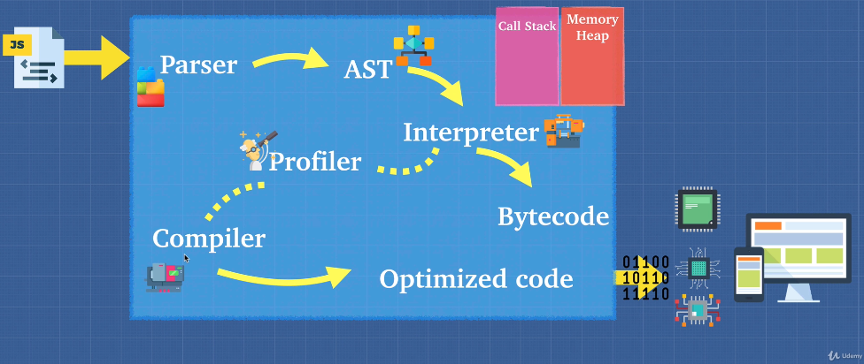

# JS language notes

Note written basing on [Advanced JavaScript Concepts course](https://www.udemy.com/advanced-javascript-concepts)

## JavaScript foundation

**JS engine**

JS is interpreting and single threading languages using callbacks. JS engine is a mechanism that understands JS and tells PC what to do (similar to CLR). There are a lot of JS engines (ECMAScript engines). 

For example: 
- Chrome V8 engine is a JS engine developed by The Chromium Project for Google Chrome and Chromium browser. Also Node.JS uses Chrome V8 engine. V8 engine doesn't generate any intermediate code and compiles JS directly into machine code
- SpiderMonkey is developed by Brendan Eich and currently used by FireFox. This's the very first JS engine

ECMA is European Computer Manufacturer's Association is a non-profit organization that develops standards. 

The difference between ECMA script and JS is that JS is an implementation of the ECMAScript standard. For example ECMA Standard is standard for JavaScript (Netscape) and JScript (Microsoft)

Under the hood of JS engine does following:
1. JS file as input
1. Parser breaks the JS code on tokens. Each token explains what code trying to do
1. AST (astexplorer.net allows to see how JS is transformed into AST)
1. Interpreter () -> bytecode that can be executed by PC
1. Profiler takes bytecode and checks how it runs and finds ways to optimize it
1. Compiler
1. Optimized code

Babel + TS: Babel is compiler of js that takes modern js and translates it to a browser compatible JS

Compiler vs Interpreter:
- Interpreter allows to start executing of code faster but it becomes slow when it runs a lot of code
- Compiler can do optimizations so many lines of code is not a problem for compiler but it requires some time to execute program

JIT compiler is combination of compiler and interpreter and it provides cons from both compiler and interpreter worlds

Dangerous mechanisms\functions that my hurt performance of JS app:
- eval()
- arguments
- for in
- with
- delete
- hidden classes. A technique used by V8 to identify a type of objects. If you add a new property to a JS object then you V8 produces a new hidden class. Too many new properties for existing types = new hidden = worse performance;
- inline caching. Inline Cache can be treated as a fast path (shortcut) to the value/property
