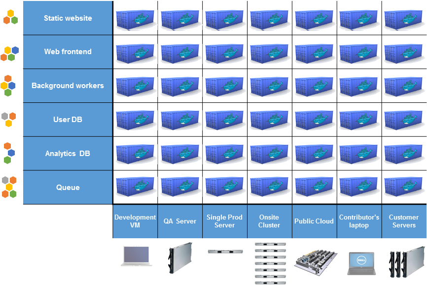
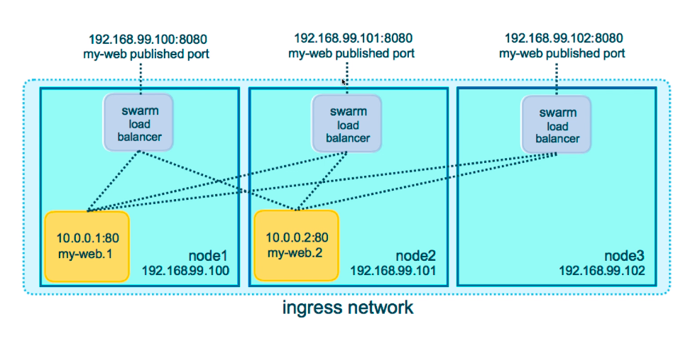
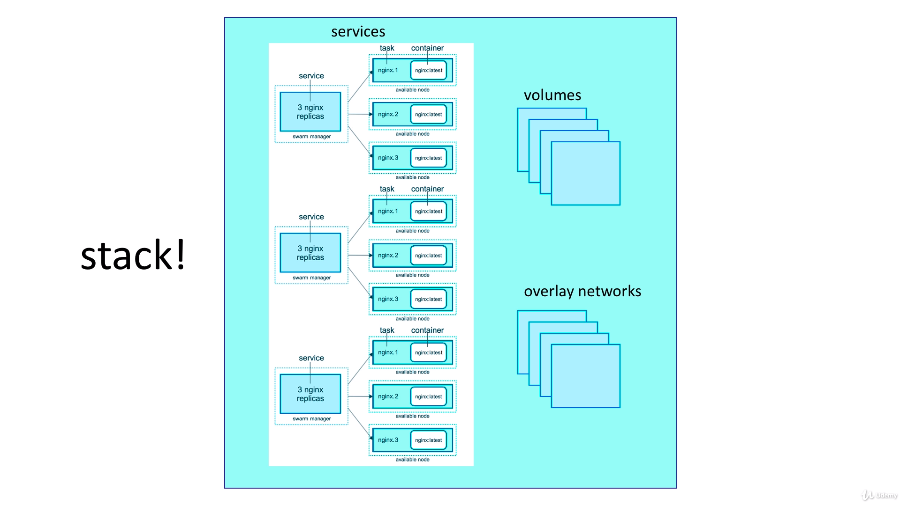

# Docker Mastery: with Kubernetes + Swarm from a Docker Captain

Notes written during [this course](https://www.udemy.com/course/docker-mastery/)

**Why do we need a docker?**

Docker allows to deploy an application to various different environments easily. It allows to prevent wasting time for maintenance and solving issues related to specific OS



## Commands

Docker command line structure:
- old: `docker <command> (options)`
- new: `docker <command> <sub-command> (option)`

`docker version` allows to verify if cli can talk to engine

`docker info` returns most values of engine

`docker exec <container_id> <command>` runs specified command

`docker node ls` show list of swarm nodes

`docker service <command>` replaces docker run in swarm

`docker swarm join-token manager` get a join token for the current node

`docker stack deploy` deploy swarm based on stack (compose) file

### Container commands

`docker container run <image>` runs an image

    - --publish 80:80 - exposes ports
    - --detach - prevents blocking of terminal
    - --name - specifies name of container
    - -t pseudo-tty - simulates a real terminal, like what ssh does
    - -i interactive - keep STDIN open even if not attached
    - -v - create a named volume (-v mysql-db:/var/lib/mysql)

`docker container ls` returns a list of running container

`docker container stop <container_id>` stops a container with specified id

`docker container run <image_name>` always starts a new container

`docker container start <container_id>` starts an existing stopped container

`docket container top <container_name>` list of started processes inside container

`docket container rm <container_id>` remove a container

    - --force allows to rm a running container

`docker container logs <container_id>` returns logs from stdout of a container

    - -f watch logs output

`docker container inspect <container_id>` returns detailed information 

`docker container stats` returns performance stats for all containers

`docker container port <container>` returns a list of opened container 

### Network commands

`docker network ls` - show networks

    - 'host' network skips virtual network of docker, but sacrifices security of container model
    - 'none' removes eth0 and only leaves you with localhost interface in container
    - 'bridge' built-in or 3rd party extensions that give you virtual network features

`docker network inspect` inspect a network

`docker network create --driver` create a network

`docker network connect` attach a network to container

`docker network disconnect` detach a network from container

### Image commands

`docker image history <image-tag>` allows to see history of each layer in image

`docker image inspect <image-tag>` returns JSON metadata about the image

`docker image tag <source-image-tag> <target-image-tag>` assigns one or more tags to an image

`docker build -f <dockerfile-path>` build a specific docker file

### Prune

`docker image prune` to clean up just "dangling" images

`docker system prune` will clean up everything

`docker image prune -a` will remove all images you're not using

`docker system df` to see space usage

## Image vs Container

An image is the application we want to run (similar to exe file)

A container is a running instance of image (like a process)

When a developer runs `docker container run`

1. Looks for that image locally in image cache, doesn't find anything
1. Then looks in remote image repository (default to Docker Hub)
1. Downloads the latest version (nginx:latest by default)
1. Creates a new container based on that image and prepares to start
1. Gives it a virtual IP on a private network inside docker engine
1. Start container by using the commands in the image

A container is just process running on a machine. They limited to what resources they can ac cess.

## Image

Image is app binaries and dependencies of your app. Also it contains metadata about the image data and how to run the image 

A docker image consists of layers containing changes. It means, that docker doesn't store an information twice. If one layer used for 2 other images, then base layer exists in file system only as a single copy.

> When you log in to docker hub on someone's machine, then your token is stored in the local docker profile of that machine. Don't forget to log out if you don't trust that machine

### Dockerfile

`FROM` specify base image

`ENV` specify environment variable

`RUN` execute a command inside container itself

`EXPOSE` expose a port on the docker virtual network. It doesn't forward ports to the host

`CMD` is the last command that will be used to launch a container. It's   required

`WORKDIR` change working dir to root of a webhost. Using WORKDIR is preferred to using 'RUN cd /some/path'

> Tip: Combine several related to each other shell commands in a single command inside Dockerfile to prevent creating not useful layers and etc.

> Tip: Less changeable commands should be in the top inside Dockerfile

## Persistent Data

Volumes make special location outside of container inside host file system

> Tip: Use volumes to persist databases of a mysql or psql server

Bind mounts link container path to host path. Mounts maps a host file or directory to a container file or directory. Basically just two locations pointing to the same file(s). Bounds are possible to specify only during running a container

> Tip: Use bind mounts for files that often is changed like index.html for nginx

## Networks

Networks configuration of docker: bridge, 

### Bridge


> Tip: Static IP's and using IP's for talking to containers is an anti-pattern. Do your best to avoid it. IP can be changed

> Tip: Default DNS name of a container is the name of the container

## Docker compose

It allows to configure relationships between containers and save our docker container run setting in easy-to-read file

```yaml
version: '3.1'

services: # containers. same as docker run
  servicename: # a friendly name. This is also DNS name inside network
    image: # Optional if you use build
    command: # Optional, replace the default CMD specified by the image
    volumes: # optional, same as -v in docker run
  servicename2:

volumes: # Optional, same as docker volume create

networks: # Optional, same as docker network create
```

## Docker swarm

Docker swarm is orchestration tool allowing to manage docker container. One of responsibilities of the orchestration tool is to make that started services still work

Orchestration tool allows to:

1. automate container lifecycle;
1. easily scale up\down;
1. ensure containers are re-crated if they fail;
1. replace containers without downtime (blue\green) deploy;
1. control where containers get started;
1. create cross-node virtual networks;
1. ensure only trusted servers can run our container;
1. store secrets and get them to the right container;

`docker swarm init` initialize swarm

What happens during `docker swarm init`:

- root Signing Certificate created for our swarm;
- certificate is issued for first manager node;
- join tokens are created
- raft database create to store root CA, config and secrets (everything is encrypted)

### Manager node and worked node features

Manager node:

1. Accepts command form client and creates service object;
1. Reconciliation loop for service objects and creates tasks;
1. Allocates IP addresses to tasks;
1. Assigns nodes to tasks;
1. Checks in on workers;

Worker node:

1. Connects to dispatcher to check on assigned tasks;
1. Executes the tasks assigned to worker node;

### Load balancing

Swarm provides load balancing feature out of box



By default swarm uses round robin algorithm to get next instance to process a request. It's stateless and doesn't bind a client to specific server

### Stacks

Stacks is compose file for production swarms. Stack manage all deployment objects for us, including overlay network per stack. Adds stack name to start of their name



Example of stack config

```yaml
version: "3"
services:
  redis: 
    image: redis:alpine
    ports:
      - "6379"
    networks:
      - frontend
    deploy:
      replicas: 2
      update_config:
        parallelism: 2
        delay: 10s
      restart_policy:
        condition: on-failure
  db: 
    image: postgres:9.4
    volumes:
      - db-data:/var/lib/postgresql/data
    networks:
      - backend
    deploy:
      placement:
        constraints: [node.role == manager]
  vote:
    image: dockersamples/examplevotingapp_vote:before
    ports:
      - 5000:80
    networks:
      - frontend
    depends_on:
      - redis
    deploy:
      replicas: 2
      update_config:
        parallelism: 2
      restart_policy:
        condition: on-failure
  result:
    image: dockersamples/examplevotingapp_result:before
    ports:
      - 5001:80
    networks:
      - backend
    depends_on:
      - db
    deploy:
      replicas: 1
      update_config:
        parallelism: 2
        delay: 10s
      restart_policy:
        condition: on-failure
  worker:
    image: dockersamples/examplevotingapp_worker
    networks:
      - frontend
      - backend
    deploy:
      mode: replicated
      replicas: 1
      labels: [APP=VOTING]
      restart_policy:
        condition: on-failure
        delay: 10s
        max_attempts: 3
        window: 120s
      placement:
        constraints: [node.role == manager]
networks:
  frontend:
  backend:
volumes:
  db-data
```

**Useful commands:**

`docker stack services <stack-name>` shows list of running replicas for specific stack

`docker stack ps <stack-name>` shows list of running services on nodes for specific stack
